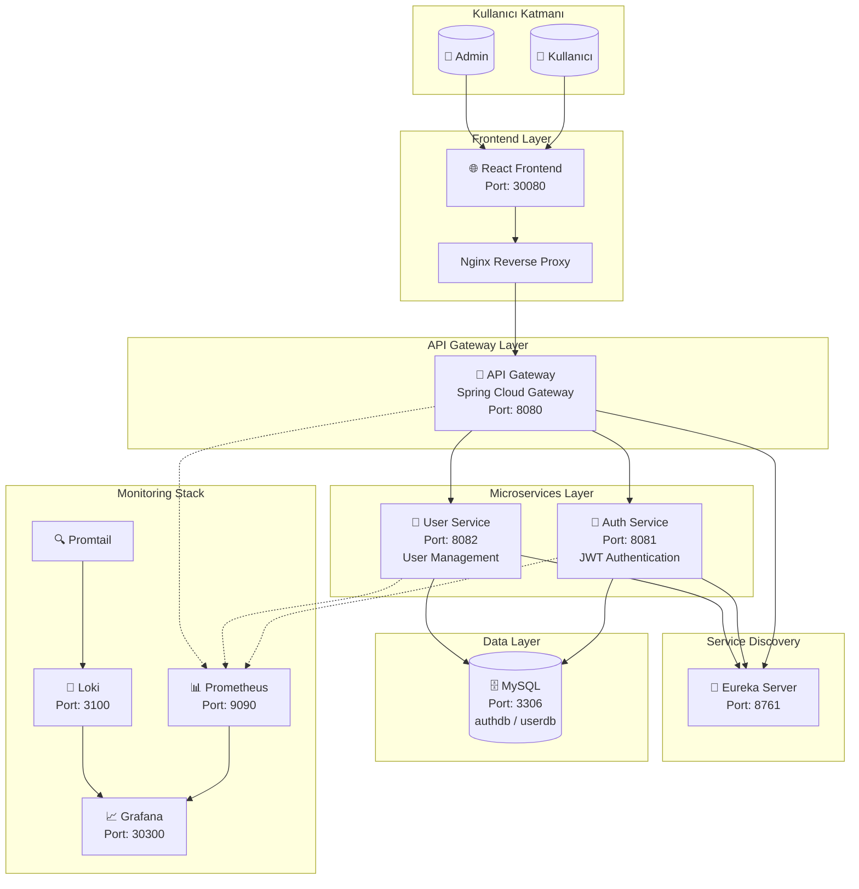

# Sistem Mimarisi (Component Diagram)

```mermaid
graph TB
    subgraph "Kullanıcı Katmanı"
        U[("👤 Kullanıcı")]
        A[("👑 Admin")]
    end

    subgraph "Frontend Layer"
        FE["🌐 React Frontend<br/>Port: 30080"]
        NGINX["Nginx Reverse Proxy"]
    end

    subgraph "API Gateway Layer"
        GW["🚪 API Gateway<br/>Spring Cloud Gateway<br/>Port: 8080"]
    end

    subgraph "Service Discovery"
        EU["📍 Eureka Server<br/>Port: 8761"]
    end

    subgraph "Microservices Layer"
        AUTH["🔐 Auth Service<br/>Port: 8081<br/>JWT Authentication"]
        USER["👥 User Service<br/>Port: 8082<br/>User Management"]
    end

    subgraph "Data Layer"
        MYSQL[("🗄️ MySQL<br/>Port: 3306<br/>authdb / userdb")]
    end

    subgraph "Monitoring Stack"
        PROM["📊 Prometheus<br/>Port: 9090"]
        LOKI["📝 Loki<br/>Port: 3100"]
        GRAF["📈 Grafana<br/>Port: 30300"]
        TAIL["🔍 Promtail"]
    end

    U --> FE
    A --> FE
    FE --> NGINX
    NGINX --> GW
    GW --> EU
    GW --> AUTH
    GW --> USER
    AUTH --> EU
    USER --> EU
    AUTH --> MYSQL
    USER --> MYSQL
    AUTH -.-> PROM
    USER -.-> PROM
    GW -.-> PROM
    TAIL --> LOKI
    PROM --> GRAF
    LOKI --> GRAF
```
