# Use Case Diagram - Kapsamlı

Tüm sistem özelliklerini kapsayan use case diyagramı.

```mermaid
graph TB
    subgraph "Aktörler"
        Guest[("🔓 Misafir")]
        User[("👤 Kullanıcı")]
        Admin[("👑 Admin")]
        System[("⚙️ Sistem")]
    end

    subgraph "Kimlik Doğrulama Modülü"
        UC_Login["🔑 Giriş Yap"]
        UC_Register["📝 Kayıt Ol"]
        UC_Logout["🚪 Çıkış Yap"]
        UC_ValidateToken["🎫 Token Doğrula"]
        UC_RefreshToken["🔄 Token Yenile"]
    end

    subgraph "Kullanıcı Profil Modülü"
        UC_ViewProfile["👁️ Profil Görüntüle"]
        UC_UpdateProfile["✏️ Profil Güncelle"]
        UC_ChangePassword["🔐 Şifre Değiştir"]
    end

    subgraph "Admin Yönetim Modülü"
        UC_ListUsers["📋 Kullanıcıları Listele"]
        UC_SearchUser["🔍 Kullanıcı Ara"]
        UC_ViewUserDetail["📄 Kullanıcı Detayı"]
        UC_ChangeRole["🎭 Rol Değiştir"]
        UC_DeleteUser["❌ Kullanıcı Sil"]
        UC_CreateUser["➕ Kullanıcı Oluştur"]
    end

    subgraph "Monitoring Modülü"
        UC_ViewMetrics["📊 Metrikleri Gör"]
        UC_ViewLogs["📝 Logları Gör"]
        UC_ViewDashboard["📈 Dashboard"]
        UC_SetAlerts["🚨 Alarm Kur"]
    end

    subgraph "API Gateway Modülü"
        UC_RateLimit["⏱️ Rate Limiting"]
        UC_LoadBalance["⚖️ Yük Dengeleme"]
        UC_RouteRequest["🔀 İstek Yönlendirme"]
    end

    subgraph "DevOps Modülü"
        UC_Deploy["🚀 Deploy"]
        UC_Rollback["⏪ Rollback"]
        UC_Scale["📈 Ölçeklendir"]
    end

    %% Misafir İşlemleri
    Guest --> UC_Login
    Guest --> UC_Register

    %% Kullanıcı İşlemleri
    User --> UC_Login
    User --> UC_Logout
    User --> UC_ViewProfile
    User --> UC_UpdateProfile
    User --> UC_ChangePassword

    %% Admin İşlemleri
    Admin --> UC_Login
    Admin --> UC_Logout
    Admin --> UC_ListUsers
    Admin --> UC_SearchUser
    Admin --> UC_ViewUserDetail
    Admin --> UC_ChangeRole
    Admin --> UC_DeleteUser
    Admin --> UC_CreateUser
    Admin --> UC_ViewMetrics
    Admin --> UC_ViewLogs
    Admin --> UC_ViewDashboard
    Admin --> UC_SetAlerts
    Admin --> UC_Deploy
    Admin --> UC_Rollback
    Admin --> UC_Scale

    %% Sistem İşlemleri
    System --> UC_ValidateToken
    System --> UC_RefreshToken
    System --> UC_RateLimit
    System --> UC_LoadBalance
    System --> UC_RouteRequest

    %% Include ilişkileri
    UC_Login -.->|include| UC_ValidateToken
    UC_ViewProfile -.->|include| UC_ValidateToken
    UC_UpdateProfile -.->|include| UC_ValidateToken
    UC_ListUsers -.->|include| UC_ValidateToken
    UC_ChangeRole -.->|include| UC_ValidateToken
```

## Use Case Açıklamaları

| Use Case | Aktör | Açıklama |
|----------|-------|----------|
| Giriş Yap | Tümü | Kullanıcı adı ve şifre ile sisteme giriş |
| Kayıt Ol | Misafir | Yeni kullanıcı hesabı oluşturma |
| Çıkış Yap | User, Admin | Oturumu sonlandırma |
| Token Doğrula | Sistem | JWT token geçerliliğini kontrol etme |
| Profil Görüntüle | User | Kendi profil bilgilerini görme |
| Profil Güncelle | User | Profil bilgilerini düzenleme |
| Kullanıcıları Listele | Admin | Tüm kullanıcıları listeleme |
| Rol Değiştir | Admin | Kullanıcı rolünü USER/ADMIN yapma |
| Kullanıcı Sil | Admin | Kullanıcı hesabını silme |
| Metrikleri Gör | Admin | Prometheus metriklerini görüntüleme |
| Logları Gör | Admin | Loki üzerinden logları inceleme |
| Deploy | Admin | CI/CD ile yeni sürüm deploy etme |
