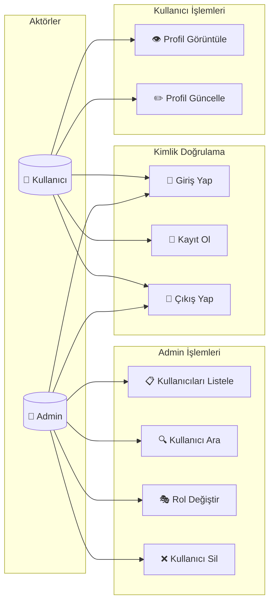

# Use Case Diyagramı

```mermaid
graph LR
    subgraph Aktörler
        U[("👤 Kullanıcı")]
        A[("👑 Admin")]
    end

    subgraph "Kimlik Doğrulama"
        UC1["🔑 Giriş Yap"]
        UC2["📝 Kayıt Ol"]
        UC3["🚪 Çıkış Yap"]
    end

    subgraph "Kullanıcı İşlemleri"
        UC4["👁️ Profil Görüntüle"]
        UC5["✏️ Profil Güncelle"]
    end

    subgraph "Admin İşlemleri"
        UC6["📋 Kullanıcıları Listele"]
        UC7["🔍 Kullanıcı Ara"]
        UC8["🎭 Rol Değiştir"]
        UC9["❌ Kullanıcı Sil"]
    end

    U --> UC1
    U --> UC2
    U --> UC3
    U --> UC4
    U --> UC5

    A --> UC1
    A --> UC3
    A --> UC6
    A --> UC7
    A --> UC8
    A --> UC9
```
