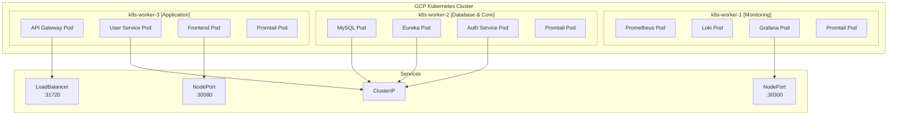

# Kubernetes Deployment Diyagramı

```mermaid
graph TB
    subgraph "GCP Kubernetes Cluster"
        subgraph "k8s-worker-1 [Monitoring]"
            P1["Prometheus Pod"]
            L1["Loki Pod"]
            G1["Grafana Pod"]
            PT1["Promtail Pod"]
        end

        subgraph "k8s-worker-2 [Database & Core]"
            M1["MySQL Pod"]
            E1["Eureka Pod"]
            AU1["Auth Service Pod"]
            PT2["Promtail Pod"]
        end

        subgraph "k8s-worker-3 [Application]"
            GW1["API Gateway Pod"]
            US1["User Service Pod"]
            FE1["Frontend Pod"]
            PT3["Promtail Pod"]
        end
    end

    subgraph "Services"
        S1["LoadBalancer<br/>:31720"]
        S2["NodePort<br/>:30080"]
        S3["NodePort<br/>:30300"]
        S4["ClusterIP"]
    end

    GW1 --> S1
    FE1 --> S2
    G1 --> S3
    M1 --> S4
    E1 --> S4
    AU1 --> S4
    US1 --> S4
```
