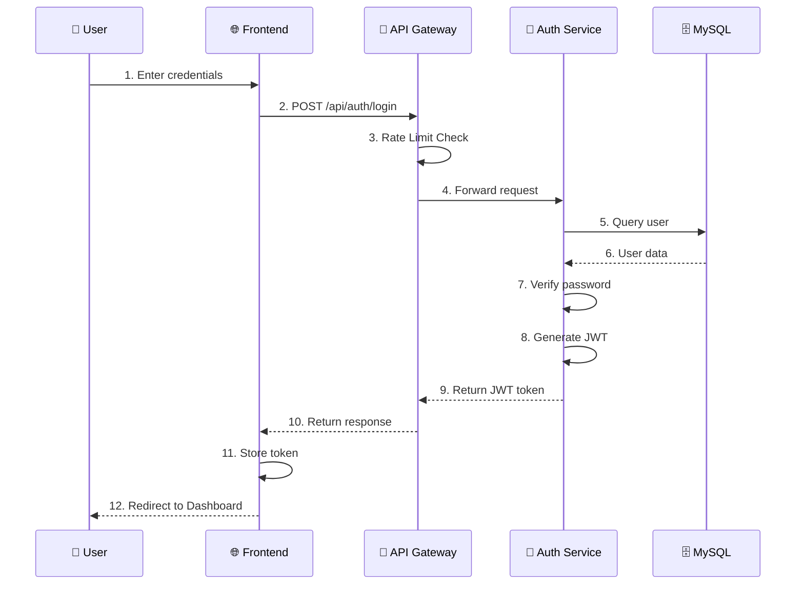

# Sequence Diagram - Login Flow

```mermaid
sequenceDiagram
    participant U as 👤 User
    participant FE as 🌐 Frontend
    participant GW as 🚪 API Gateway
    participant AU as 🔐 Auth Service
    participant DB as 🗄️ MySQL

    U->>FE: 1. Enter credentials
    FE->>GW: 2. POST /api/auth/login
    GW->>GW: 3. Rate Limit Check
    GW->>AU: 4. Forward request
    AU->>DB: 5. Query user
    DB-->>AU: 6. User data
    AU->>AU: 7. Verify password
    AU->>AU: 8. Generate JWT
    AU-->>GW: 9. Return JWT token
    GW-->>FE: 10. Return response
    FE->>FE: 11. Store token
    FE-->>U: 12. Redirect to Dashboard
```
