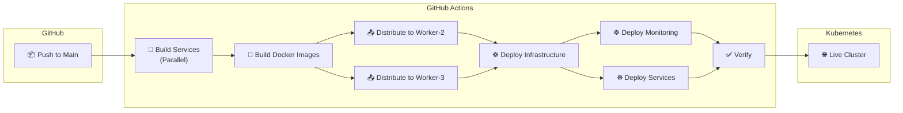

# CI/CD Pipeline Flow

```mermaid
graph LR
    subgraph "GitHub"
        GH["📦 Push to Main"]
    end

    subgraph "GitHub Actions"
        B1["🔨 Build Services<br/>(Parallel)"]
        B2["🐳 Build Docker Images"]
        D1["📤 Distribute to Worker-2"]
        D2["📤 Distribute to Worker-3"]
        K1["☸️ Deploy Infrastructure"]
        K2["☸️ Deploy Monitoring"]
        K3["☸️ Deploy Services"]
        V["✅ Verify"]
    end

    subgraph "Kubernetes"
        CL["🌐 Live Cluster"]
    end

    GH --> B1
    B1 --> B2
    B2 --> D1
    B2 --> D2
    D1 --> K1
    D2 --> K1
    K1 --> K2
    K1 --> K3
    K2 --> V
    K3 --> V
    V --> CL
```
