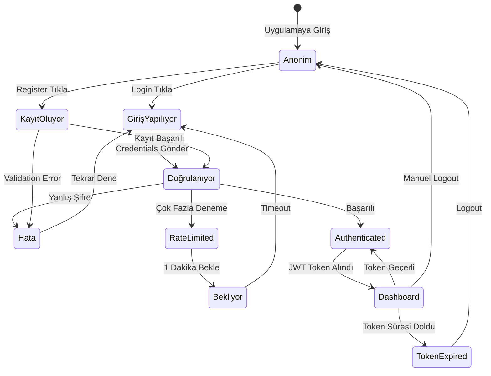

# State Diagram - Kullanıcı Oturum Durumu

```mermaid
stateDiagram-v2
    [*] --> Anonim: Uygulamaya Giriş

    Anonim --> GirişYapılıyor: Login Tıkla
    GirişYapılıyor --> Doğrulanıyor: Credentials Gönder
    
    Doğrulanıyor --> Hata: Yanlış Şifre
    Doğrulanıyor --> RateLimited: Çok Fazla Deneme
    Doğrulanıyor --> Authenticated: Başarılı
    
    Hata --> GirişYapılıyor: Tekrar Dene
    RateLimited --> Bekliyor: 1 Dakika Bekle
    Bekliyor --> GirişYapılıyor: Timeout
    
    Authenticated --> Dashboard: JWT Token Alındı
    Dashboard --> Authenticated: Token Geçerli
    Dashboard --> TokenExpired: Token Süresi Doldu
    
    TokenExpired --> Anonim: Logout
    Dashboard --> Anonim: Manuel Logout
    
    Anonim --> KayıtOluyor: Register Tıkla
    KayıtOluyor --> Doğrulanıyor: Kayıt Başarılı
    KayıtOluyor --> Hata: Validation Error
```
