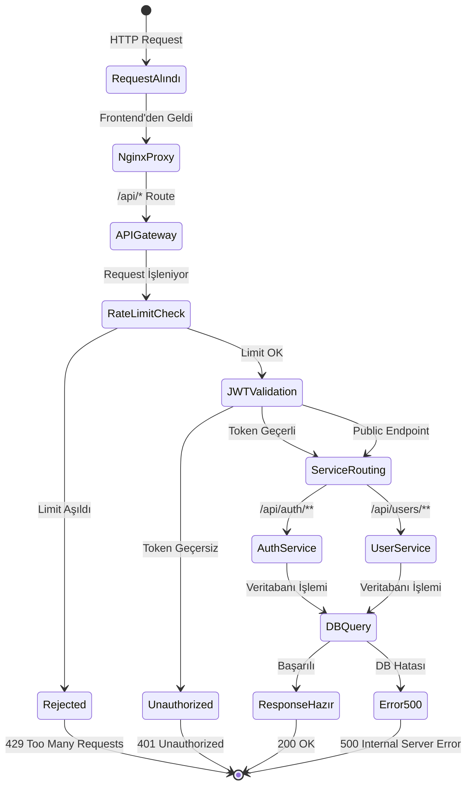

# State Diagram - API Request Yaşam Döngüsü

```mermaid
stateDiagram-v2
    [*] --> RequestAlındı: HTTP Request

    RequestAlındı --> NginxProxy: Frontend'den Geldi
    NginxProxy --> APIGateway: /api/* Route
    
    APIGateway --> RateLimitCheck: Request İşleniyor
    RateLimitCheck --> Rejected: Limit Aşıldı
    RateLimitCheck --> JWTValidation: Limit OK
    
    JWTValidation --> Unauthorized: Token Geçersiz
    JWTValidation --> ServiceRouting: Token Geçerli
    JWTValidation --> ServiceRouting: Public Endpoint
    
    ServiceRouting --> AuthService: /api/auth/**
    ServiceRouting --> UserService: /api/users/**
    
    AuthService --> DBQuery: Veritabanı İşlemi
    UserService --> DBQuery: Veritabanı İşlemi
    
    DBQuery --> ResponseHazır: Başarılı
    DBQuery --> Error500: DB Hatası
    
    ResponseHazır --> [*]: 200 OK
    Rejected --> [*]: 429 Too Many Requests
    Unauthorized --> [*]: 401 Unauthorized
    Error500 --> [*]: 500 Internal Server Error
```
