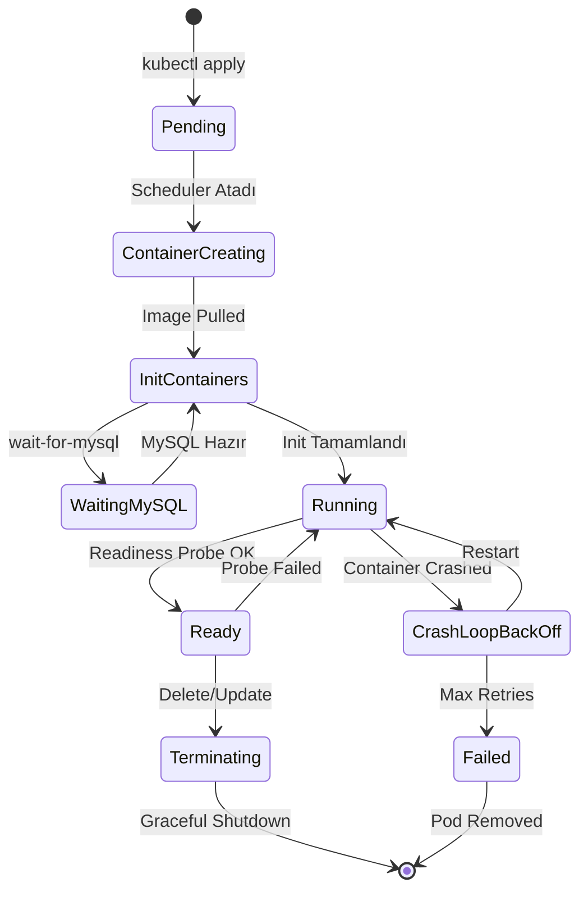

# State Diagram - Pod Yaşam Döngüsü (Kubernetes)

```mermaid
stateDiagram-v2
    [*] --> Pending: kubectl apply

    Pending --> ContainerCreating: Scheduler Atadı
    ContainerCreating --> InitContainers: Image Pulled
    
    InitContainers --> WaitingMySQL: wait-for-mysql
    WaitingMySQL --> InitContainers: MySQL Hazır
    InitContainers --> Running: Init Tamamlandı
    
    Running --> Ready: Readiness Probe OK
    Ready --> Running: Probe Failed
    
    Running --> CrashLoopBackOff: Container Crashed
    CrashLoopBackOff --> Running: Restart
    CrashLoopBackOff --> Failed: Max Retries
    
    Ready --> Terminating: Delete/Update
    Terminating --> [*]: Graceful Shutdown
    
    Failed --> [*]: Pod Removed
```
