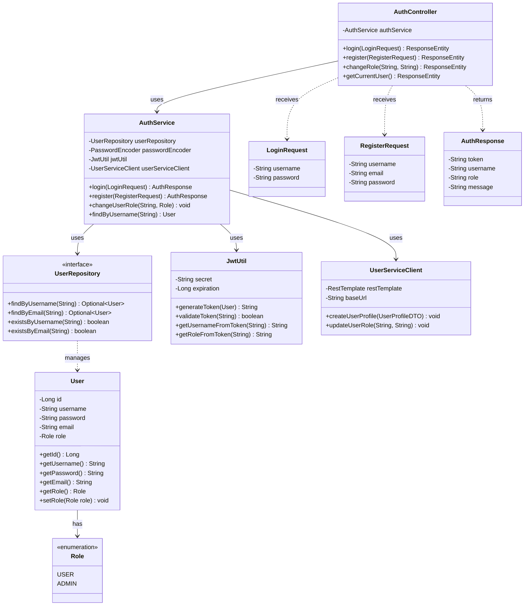
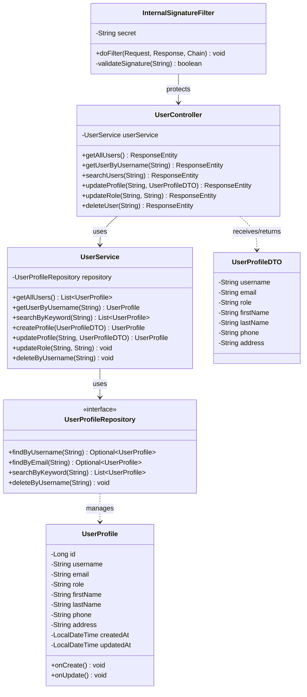
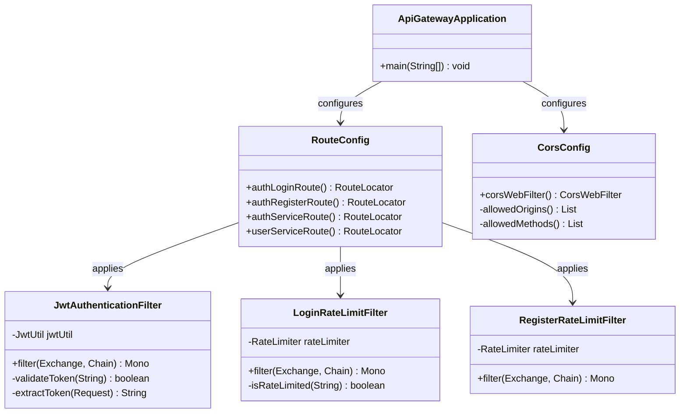

# Class Diagram

Mikroservis projesi için sınıf diyagramı.

## Auth Service Class Diagram

```mermaid
classDiagram
    class User {
        -Long id
        -String username
        -String password
        -String email
        -Role role
        +getId() Long
        +getUsername() String
        +getPassword() String
        +getEmail() String
        +getRole() Role
        +setRole(Role role) void
    }

    class Role {
        <<enumeration>>
        USER
        ADMIN
    }

    class AuthController {
        -AuthService authService
        +login(LoginRequest) ResponseEntity
        +register(RegisterRequest) ResponseEntity
        +changeRole(String, String) ResponseEntity
        +getCurrentUser() ResponseEntity
    }

    class AuthService {
        -UserRepository userRepository
        -PasswordEncoder passwordEncoder
        -JwtUtil jwtUtil
        -UserServiceClient userServiceClient
        +login(LoginRequest) AuthResponse
        +register(RegisterRequest) AuthResponse
        +changeUserRole(String, Role) void
        +findByUsername(String) User
    }

    class UserRepository {
        <<interface>>
        +findByUsername(String) Optional~User~
        +findByEmail(String) Optional~User~
        +existsByUsername(String) boolean
        +existsByEmail(String) boolean
    }

    class JwtUtil {
        -String secret
        -Long expiration
        +generateToken(User) String
        +validateToken(String) boolean
        +getUsernameFromToken(String) String
        +getRoleFromToken(String) String
    }

    class LoginRequest {
        -String username
        -String password
    }

    class RegisterRequest {
        -String username
        -String email
        -String password
    }

    class AuthResponse {
        -String token
        -String username
        -String role
        -String message
    }

    class UserServiceClient {
        -RestTemplate restTemplate
        -String baseUrl
        +createUserProfile(UserProfileDTO) void
        +updateUserRole(String, String) void
    }

    User --> Role : has
    AuthController --> AuthService : uses
    AuthService --> UserRepository : uses
    AuthService --> JwtUtil : uses
    AuthService --> UserServiceClient : uses
    AuthController ..> LoginRequest : receives
    AuthController ..> RegisterRequest : receives
    AuthController ..> AuthResponse : returns
    UserRepository ..> User : manages
```

## User Service Class Diagram

```mermaid
classDiagram
    class UserProfile {
        -Long id
        -String username
        -String email
        -String role
        -String firstName
        -String lastName
        -String phone
        -String address
        -LocalDateTime createdAt
        -LocalDateTime updatedAt
        +onCreate() void
        +onUpdate() void
    }

    class UserController {
        -UserService userService
        +getAllUsers() ResponseEntity
        +getUserByUsername(String) ResponseEntity
        +searchUsers(String) ResponseEntity
        +updateProfile(String, UserProfileDTO) ResponseEntity
        +updateRole(String, String) ResponseEntity
        +deleteUser(String) ResponseEntity
    }

    class UserService {
        -UserProfileRepository repository
        +getAllUsers() List~UserProfile~
        +getUserByUsername(String) UserProfile
        +searchByKeyword(String) List~UserProfile~
        +createProfile(UserProfileDTO) UserProfile
        +updateProfile(String, UserProfileDTO) UserProfile
        +updateRole(String, String) void
        +deleteByUsername(String) void
    }

    class UserProfileRepository {
        <<interface>>
        +findByUsername(String) Optional~UserProfile~
        +findByEmail(String) Optional~UserProfile~
        +searchByKeyword(String) List~UserProfile~
        +deleteByUsername(String) void
    }

    class UserProfileDTO {
        -String username
        -String email
        -String role
        -String firstName
        -String lastName
        -String phone
        -String address
    }

    class InternalSignatureFilter {
        -String secret
        +doFilter(Request, Response, Chain) void
        -validateSignature(String) boolean
    }

    UserController --> UserService : uses
    UserService --> UserProfileRepository : uses
    UserProfileRepository ..> UserProfile : manages
    UserController ..> UserProfileDTO : receives/returns
    InternalSignatureFilter --> UserController : protects
```

## API Gateway Class Diagram

```mermaid
classDiagram
    class ApiGatewayApplication {
        +main(String[]) void
    }

    class JwtAuthenticationFilter {
        -JwtUtil jwtUtil
        +filter(Exchange, Chain) Mono
        -validateToken(String) boolean
        -extractToken(Request) String
    }

    class LoginRateLimitFilter {
        -RateLimiter rateLimiter
        +filter(Exchange, Chain) Mono
        -isRateLimited(String) boolean
    }

    class RegisterRateLimitFilter {
        -RateLimiter rateLimiter
        +filter(Exchange, Chain) Mono
    }

    class RouteConfig {
        +authLoginRoute() RouteLocator
        +authRegisterRoute() RouteLocator
        +authServiceRoute() RouteLocator
        +userServiceRoute() RouteLocator
    }

    class CorsConfig {
        +corsWebFilter() CorsWebFilter
        -allowedOrigins() List
        -allowedMethods() List
    }

    ApiGatewayApplication --> RouteConfig : configures
    RouteConfig --> JwtAuthenticationFilter : applies
    RouteConfig --> LoginRateLimitFilter : applies
    RouteConfig --> RegisterRateLimitFilter : applies
    ApiGatewayApplication --> CorsConfig : configures
```
