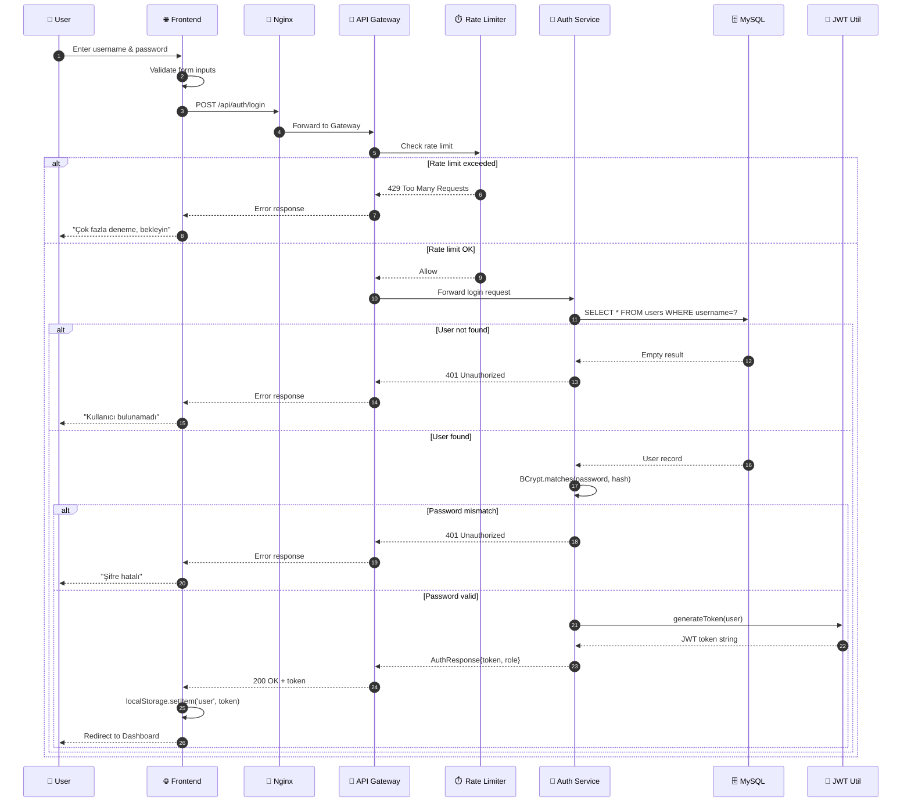
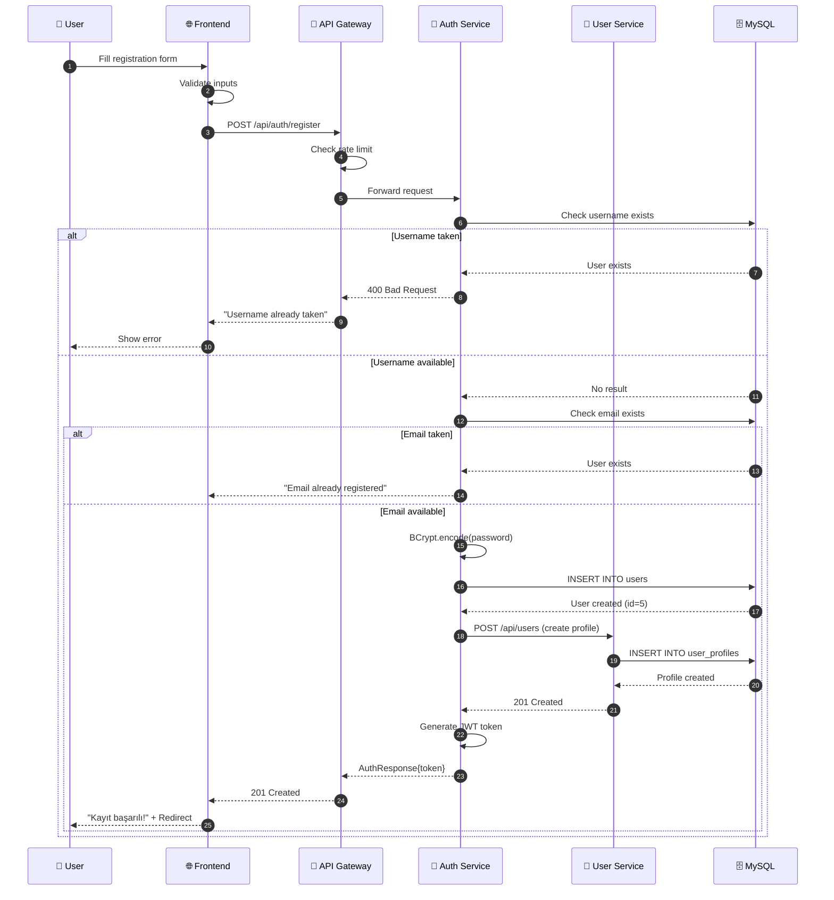
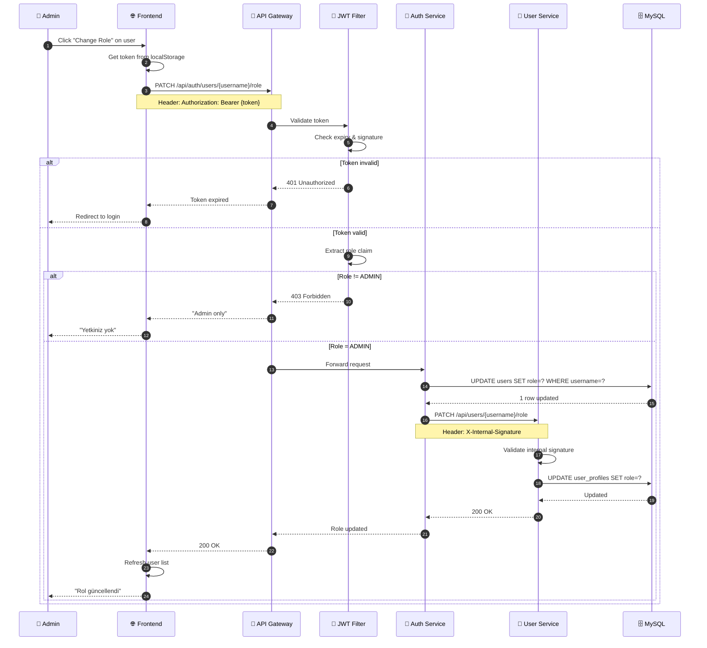
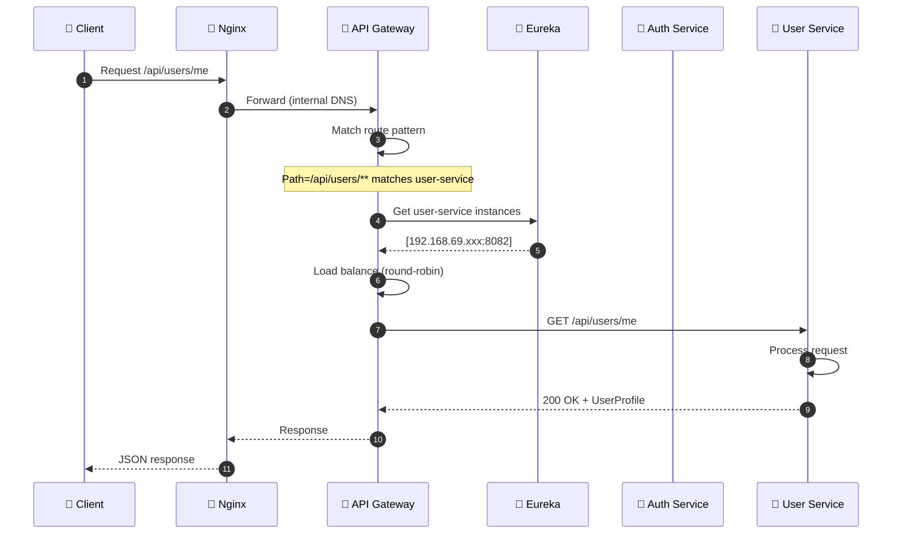
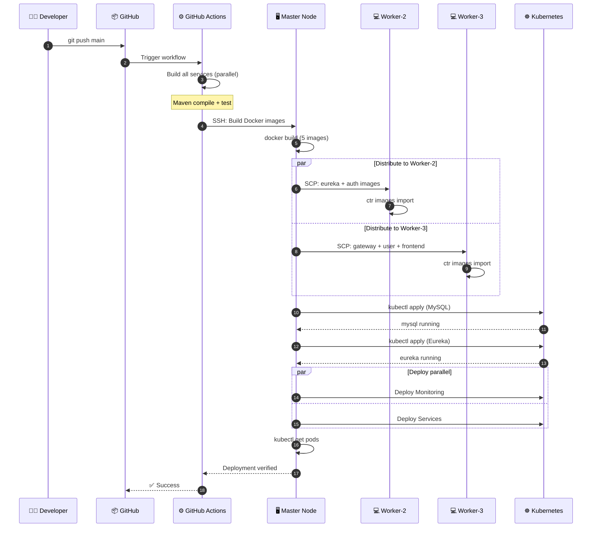

# Sequence Diagrams

## 1. Login Flow (Detaylı)

```mermaid
sequenceDiagram
    autonumber
    participant U as 👤 User
    participant FE as 🌐 Frontend
    participant NG as 📡 Nginx
    participant GW as 🚪 API Gateway
    participant RL as ⏱️ Rate Limiter
    participant AU as 🔐 Auth Service
    participant DB as 🗄️ MySQL
    participant JWT as 🎫 JWT Util

    U->>FE: Enter username & password
    FE->>FE: Validate form inputs
    FE->>NG: POST /api/auth/login
    NG->>GW: Forward to Gateway
    
    GW->>RL: Check rate limit
    alt Rate limit exceeded
        RL-->>GW: 429 Too Many Requests
        GW-->>FE: Error response
        FE-->>U: "Çok fazla deneme, bekleyin"
    else Rate limit OK
        RL-->>GW: Allow
        GW->>AU: Forward login request
        AU->>DB: SELECT * FROM users WHERE username=?
        
        alt User not found
            DB-->>AU: Empty result
            AU-->>GW: 401 Unauthorized
            GW-->>FE: Error response
            FE-->>U: "Kullanıcı bulunamadı"
        else User found
            DB-->>AU: User record
            AU->>AU: BCrypt.matches(password, hash)
            
            alt Password mismatch
                AU-->>GW: 401 Unauthorized
                GW-->>FE: Error response
                FE-->>U: "Şifre hatalı"
            else Password valid
                AU->>JWT: generateToken(user)
                JWT-->>AU: JWT token string
                AU-->>GW: AuthResponse{token, role}
                GW-->>FE: 200 OK + token
                FE->>FE: localStorage.setItem('user', token)
                FE-->>U: Redirect to Dashboard
            end
        end
    end
```

## 2. Register Flow

```mermaid
sequenceDiagram
    autonumber
    participant U as 👤 User
    participant FE as 🌐 Frontend
    participant GW as 🚪 API Gateway
    participant AU as 🔐 Auth Service
    participant US as 👥 User Service
    participant DB as 🗄️ MySQL

    U->>FE: Fill registration form
    FE->>FE: Validate inputs
    FE->>GW: POST /api/auth/register
    GW->>GW: Check rate limit
    GW->>AU: Forward request

    AU->>DB: Check username exists
    alt Username taken
        DB-->>AU: User exists
        AU-->>GW: 400 Bad Request
        GW-->>FE: "Username already taken"
        FE-->>U: Show error
    else Username available
        DB-->>AU: No result
        AU->>DB: Check email exists
        alt Email taken
            DB-->>AU: User exists
            AU-->>FE: "Email already registered"
        else Email available
            AU->>AU: BCrypt.encode(password)
            AU->>DB: INSERT INTO users
            DB-->>AU: User created (id=5)
            
            AU->>US: POST /api/users (create profile)
            US->>DB: INSERT INTO user_profiles
            DB-->>US: Profile created
            US-->>AU: 201 Created
            
            AU->>AU: Generate JWT token
            AU-->>GW: AuthResponse{token}
            GW-->>FE: 201 Created
            FE-->>U: "Kayıt başarılı!" + Redirect
        end
    end
```

## 3. Admin: Kullanıcı Rol Değiştirme

```mermaid
sequenceDiagram
    autonumber
    participant A as 👑 Admin
    participant FE as 🌐 Frontend
    participant GW as 🚪 API Gateway
    participant JWT as 🎫 JWT Filter
    participant AU as 🔐 Auth Service
    participant US as 👥 User Service
    participant DB as 🗄️ MySQL

    A->>FE: Click "Change Role" on user
    FE->>FE: Get token from localStorage
    FE->>GW: PATCH /api/auth/users/{username}/role
    Note over FE,GW: Header: Authorization: Bearer {token}
    
    GW->>JWT: Validate token
    JWT->>JWT: Check expiry & signature
    alt Token invalid
        JWT-->>GW: 401 Unauthorized
        GW-->>FE: Token expired
        FE-->>A: Redirect to login
    else Token valid
        JWT->>JWT: Extract role claim
        alt Role != ADMIN
            JWT-->>GW: 403 Forbidden
            GW-->>FE: "Admin only"
            FE-->>A: "Yetkiniz yok"
        else Role = ADMIN
            GW->>AU: Forward request
            AU->>DB: UPDATE users SET role=? WHERE username=?
            DB-->>AU: 1 row updated
            
            AU->>US: PATCH /api/users/{username}/role
            Note over AU,US: Header: X-Internal-Signature
            US->>US: Validate internal signature
            US->>DB: UPDATE user_profiles SET role=?
            DB-->>US: Updated
            US-->>AU: 200 OK
            
            AU-->>GW: Role updated
            GW-->>FE: 200 OK
            FE->>FE: Refresh user list
            FE-->>A: "Rol güncellendi"
        end
    end
```

## 4. API Gateway Request Routing

```mermaid
sequenceDiagram
    autonumber
    participant C as 📱 Client
    participant NG as 📡 Nginx
    participant GW as 🚪 API Gateway
    participant EU as 📍 Eureka
    participant AU as 🔐 Auth Service
    participant US as 👥 User Service

    C->>NG: Request /api/users/me
    NG->>GW: Forward (internal DNS)
    
    GW->>GW: Match route pattern
    Note over GW: Path=/api/users/** matches user-service
    
    GW->>EU: Get user-service instances
    EU-->>GW: [192.168.69.xxx:8082]
    
    GW->>GW: Load balance (round-robin)
    GW->>US: GET /api/users/me
    US->>US: Process request
    US-->>GW: 200 OK + UserProfile
    GW-->>NG: Response
    NG-->>C: JSON response
```

## 5. CI/CD Deployment Flow

```mermaid
sequenceDiagram
    autonumber
    participant D as 👨‍💻 Developer
    participant GH as 📦 GitHub
    participant GA as ⚙️ GitHub Actions
    participant M as 🖥️ Master Node
    participant W2 as 💻 Worker-2
    participant W3 as 💻 Worker-3
    participant K8s as ☸️ Kubernetes

    D->>GH: git push main
    GH->>GA: Trigger workflow
    
    GA->>GA: Build all services (parallel)
    Note over GA: Maven compile + test
    
    GA->>M: SSH: Build Docker images
    M->>M: docker build (5 images)
    
    par Distribute to Worker-2
        M->>W2: SCP: eureka + auth images
        W2->>W2: ctr images import
    and Distribute to Worker-3
        M->>W3: SCP: gateway + user + frontend
        W3->>W3: ctr images import
    end
    
    M->>K8s: kubectl apply (MySQL)
    K8s-->>M: mysql running
    
    M->>K8s: kubectl apply (Eureka)
    K8s-->>M: eureka running
    
    par Deploy parallel
        M->>K8s: Deploy Monitoring
    and
        M->>K8s: Deploy Services
    end
    
    M->>M: kubectl get pods
    M-->>GA: Deployment verified
    GA-->>GH: ✅ Success
```
