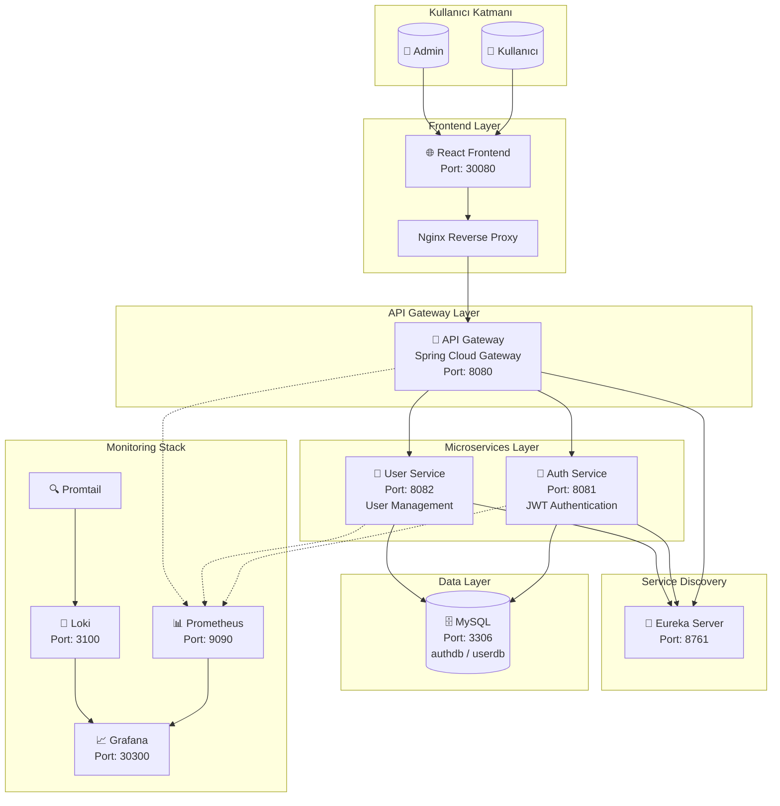
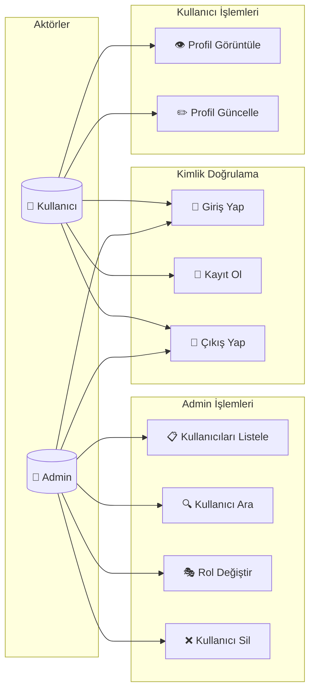
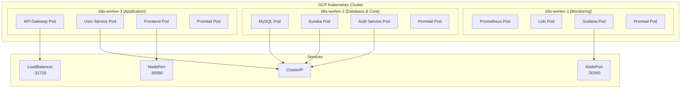
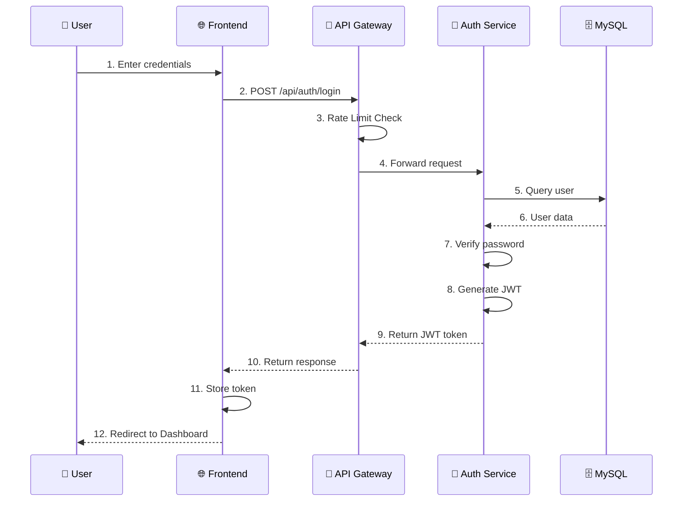
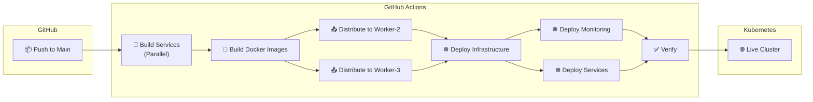
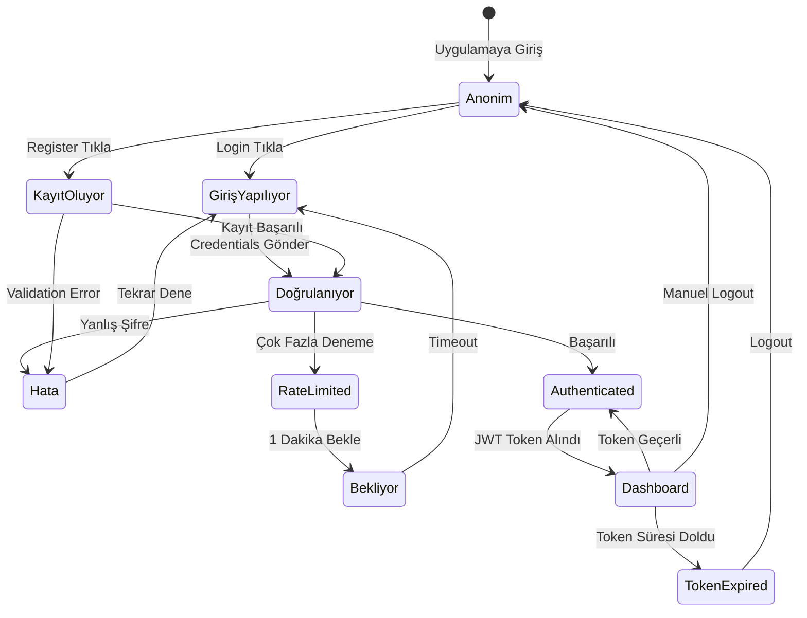
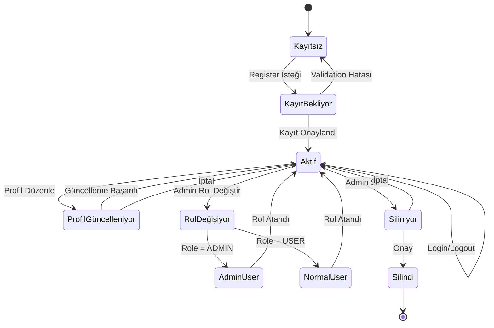
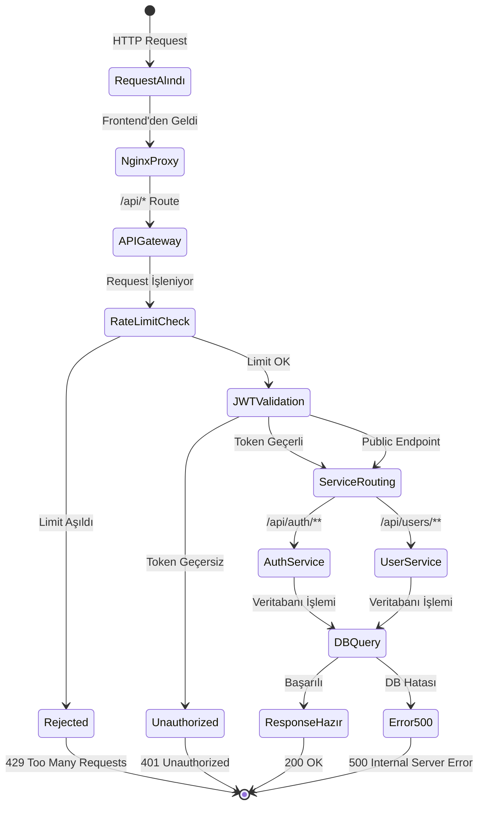
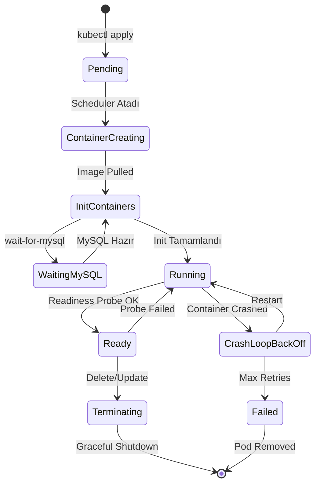

# Mikroservis Projesi - Yazılım Mimarisi Diyagramları

## 1. Sistem Mimarisi (Component Diagram)

## 2. Use Case Diyagramı

## 3. Kubernetes Deployment Diyagramı

## 4. Sequence Diagram - Login Flow

## 5. CI/CD Pipeline Flow

## 6. Teknoloji Stack Özeti

| Katman | Teknoloji |
|--------|-----------|
| Frontend | React, Vite, TailwindCSS |
| API Gateway | Spring Cloud Gateway |
| Backend | Spring Boot 3.x |
| Database | MySQL 8.0 |
| Auth | JWT (JSON Web Token) |
| Containerization | Docker, Kubernetes |
| Service Discovery | Netflix Eureka |
| Monitoring | Prometheus, Grafana |
| Logging | Loki, Promtail |
| CI/CD | GitHub Actions |
| Cloud | Google Cloud Platform |

## 7. State Diagram - Kullanıcı Oturum Durumu

## 8. State Diagram - Kullanıcı Hesap Yaşam Döngüsü

## 9. State Diagram - API Request Yaşam Döngüsü

## 10. State Diagram - Pod Yaşam Döngüsü (Kubernetes)

