# YAZILIM SİSTEM TASARIM PROJESİ

## Spring Boot Mikroservis Uygulaması

**Hazırlayan:** Olcay Alkan & Seyfullah Taş  
**Tarih:** Aralık 2025

---

# 1. PROJENİN GENEL TANIMI

## 1.1 Proje Amacı

Bu proje, modern yazılım geliştirme pratiklerini ve bulut tabanlı mimari yaklaşımları bir arada uygulayan kapsamlı bir mikroservis uygulamasıdır. Proje, kullanıcı yönetimi ve kimlik doğrulama işlemlerini gerçekleştiren, Google Cloud Platform üzerinde Kubernetes ortamında çalışan bir web uygulamasıdır.

## 1.2 Uygulama Ne Yapar?

Uygulama, aşağıdaki temel işlevleri gerçekleştirir:

- **Kullanıcı Kaydı:** Yeni kullanıcıların sisteme kayıt olması
- **Kullanıcı Girişi:** JWT token tabanlı kimlik doğrulama ile güvenli giriş
- **Profil Yönetimi:** Kullanıcıların kendi profil bilgilerini görüntüleme ve güncelleme
- **Admin Paneli:** Yöneticilerin tüm kullanıcıları listeleme, arama, rol değiştirme ve silme işlemleri
- **Monitoring:** Sistem metriklerinin ve loglarının gerçek zamanlı izlenmesi

## 1.3 Proje Kapsamı

Proje, ders kapsamında belirtilen 12 gereksinimden 10 tanesini karşılamaktadır:

|  #  |         Gereksinim         |      Durum      |
|:---:|:--------------------------:|:---------------:|
|  1  | Yazılım Mimarisi (UML)     | ✅ Tamamlandı   |
|  2  | REST API                   | ✅ Tamamlandı   |
|  3  | Bulut Çalışması (GCP)      | ✅ Tamamlandı   |
|  4  | Ölçeklenebilirlik          | ✅ Tamamlandı   |
|  5  | Token Authentication (JWT) | ✅ Tamamlandı   |
|  6  | Message Queue              | ❌ Uygulanmadı  |
|  7  | CI/CD (GitHub Actions)     | ✅ Tamamlandı   |
|  8  | Observability              | ✅ Tamamlandı   |
|  9  | Load Balancing             | ✅ Tamamlandı   |
| 10  | API Gateway                | ✅ Tamamlandı   |
| 11  | Caching                    | ❌ Uygulanmadı  |
| 12  | Kubernetes                 | ✅ Tamamlandı   |

---

# 2. KULLANILAN MİMARİ VE TEKNİK YAKLAŞIM

## 2.1 Genel Mimari

Proje, mikroservis mimarisi kullanılarak tasarlanmıştır. Her servis bağımsız olarak geliştirilebilir, deploy edilebilir ve ölçeklenebilir yapıdadır.

```
┌──────────────────────────────────────────────────────────────────┐
│                     KULLANICI (Web Browser)                      │
└───────────────────────────────┬──────────────────────────────────┘
                                │
                                ▼
┌──────────────────────────────────────────────────────────────────┐
│                     FRONTEND (React + Nginx)                     │
│                         NodePort: 30080                          │
└───────────────────────────────┬──────────────────────────────────┘
                                │
                                ▼
┌──────────────────────────────────────────────────────────────────┐
│                          API GATEWAY                             │
│                     (Spring Cloud Gateway)                       │
│              Rate Limiting, JWT Validation, Routing              │
│                        LoadBalancer: 31720                       │
└────────────────┬─────────────────────────────────┬───────────────┘
                 │                                 │
                 ▼                                 ▼
    ┌───────────────────────┐           ┌───────────────────────┐    
    │    AUTH SERVICE       │           │    USER SERVICE       │
    │    (Port: 8081)       │           │    (Port: 8082)       │
    │  - Login/Register     │           │  - Profile CRUD       │
    │  - JWT Generation     │           │  - User Management    │
    │  - Role Management    │           │  - Search             │
    └────────────┬──────────┘           └──────────┬────────────┘
                 │                                 │
                 └──────────────┬──────────────────┘
                                ▼
                        ┌──────────────────┐
                        │      MYSQL       │
                        │   (Port: 3306)   │
                        │  - authdb        │
                        │  - userdb        │
                        └──────────────────┘
```

**Sistem Mimarisi Diyagramı:**

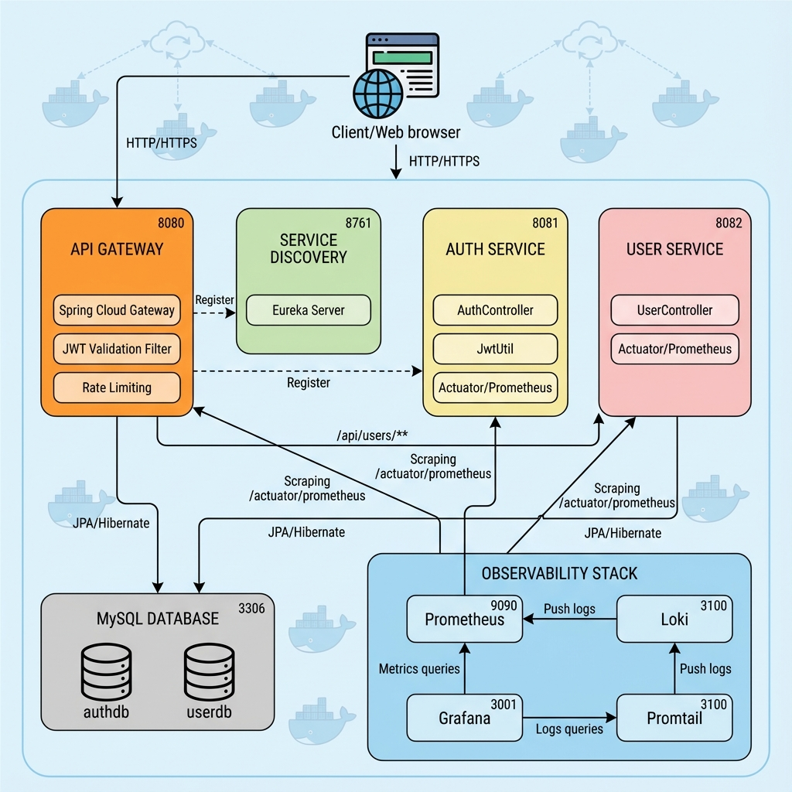

## 2.2 Mikroservis Bileşenleri

### 2.2.1 Frontend Service
- **Teknoloji:** React 18 + Vite + TailwindCSS
- **Görev:** Kullanıcı arayüzü, SPA (Single Page Application)
- **Nginx:** Reverse proxy olarak API isteklerini gateway'e yönlendirir

### 2.2.2 API Gateway
- **Teknoloji:** Spring Cloud Gateway
- **Görev:** 
  - Tüm API isteklerini merkezi noktadan yönetme
  - JWT token doğrulama
  - Rate limiting (login için 5 istek/dakika)
  - Load balancing
  - Request routing

### 2.2.3 Auth Service
- **Teknoloji:** Spring Boot 3.x
- **Görev:**
  - Kullanıcı kayıt ve giriş işlemleri
  - JWT token üretimi ve doğrulaması
  - Rol yönetimi (USER, ADMIN)
  - Password hashing (BCrypt)

### 2.2.4 User Service
- **Teknoloji:** Spring Boot 3.x
- **Görev:**
  - Kullanıcı profil yönetimi
  - CRUD operasyonları
  - Arama fonksiyonu

### 2.2.5 Eureka Server
- **Teknoloji:** Spring Cloud Netflix Eureka
- **Görev:** Service Discovery - servislerin birbirini bulması

### 2.2.6 Monitoring Stack
- **Prometheus:** Metrik toplama
- **Loki:** Log aggregation
- **Promtail:** Log collection agent
- **Grafana:** Visualization dashboard
- **Kube-State-Metrics:** Kubernetes cluster metrics

## 2.3 Kubernetes Cluster Yapısı

Proje, 1 master ve 3 worker node'dan oluşan Kubernetes cluster üzerinde çalışmaktadır:

|     Node     |      Görev      |              Servisler             |
|:------------:|:---------------:|:----------------------------------:|
| k8s-master   | Control Plane   | API Server, Scheduler, Controller  |
| k8s-worker-1 | Monitoring      | Prometheus, Loki, Grafana, Kube-State-Metrics, Promtail |
| k8s-worker-2 | Database & Core | MySQL, Eureka, Auth Service        |
| k8s-worker-3 | Application     | API Gateway, User Service, Frontend|

**Kubernetes Cluster Yapısı:**

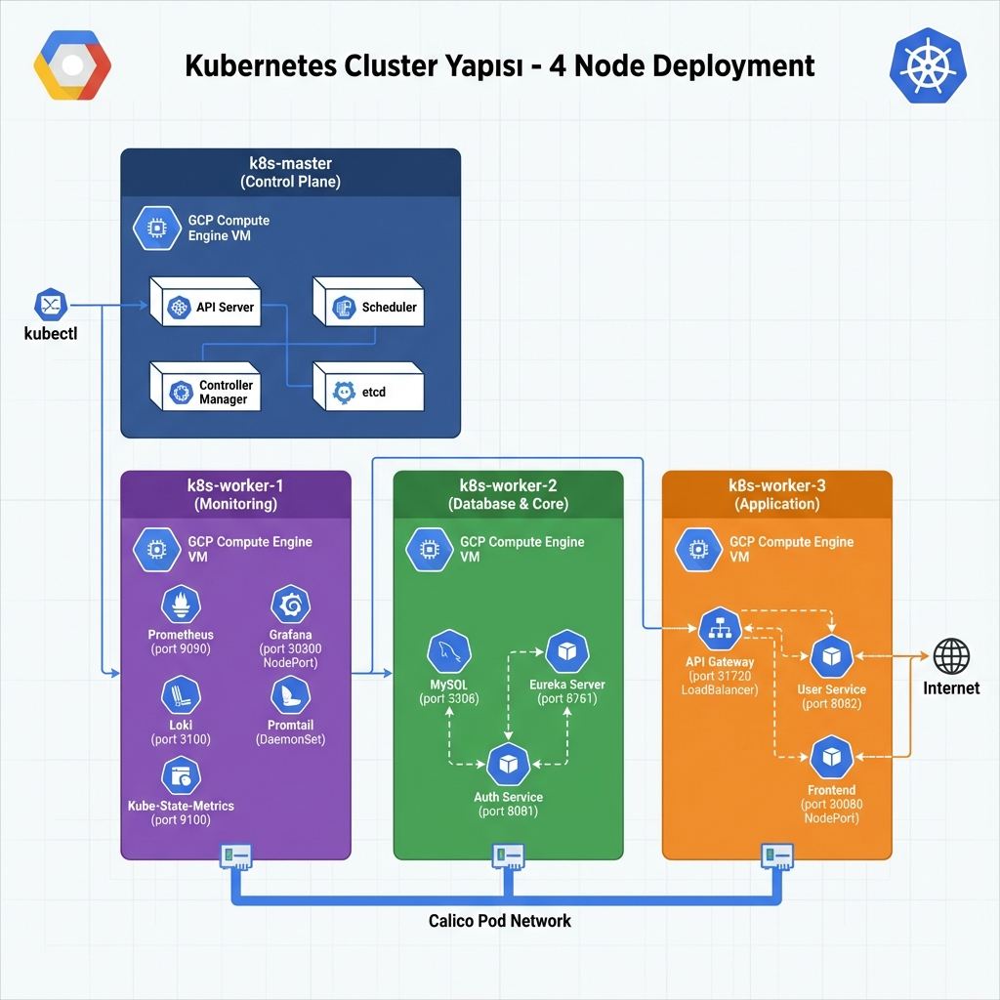

**kubectl get nodes Çıktısı:**

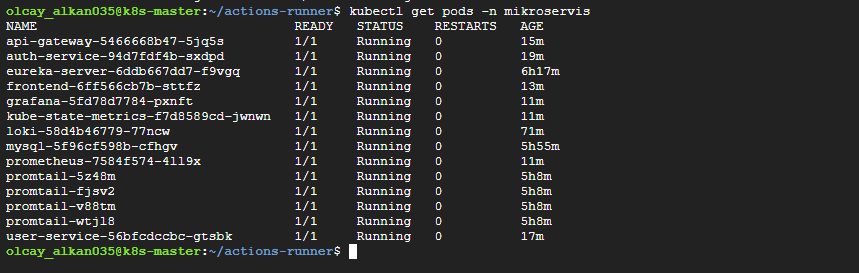

**Pods Durumu:**

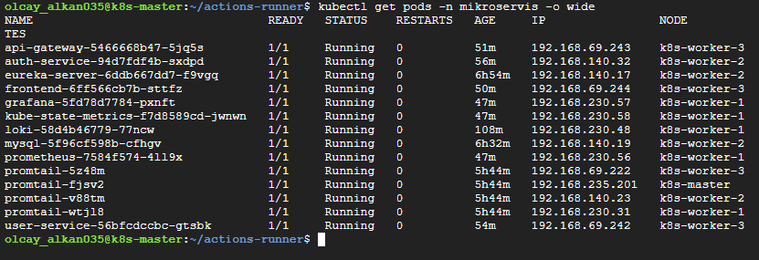

---

# 3. KULLANILAN TEKNOLOJİLER VE TOOL'LAR

## 3.1 Backend Teknolojileri

| Teknoloji | Versiyon | Kullanım Amacı |
|:-----------:|:----------:|:----------------:|
| Java        | 17         | Backend programlama dili |
| Spring Boot | 3.x        | Mikroservis framework |
| Spring Cloud Gateway | 4.x | API Gateway |
| Spring Security | 6.x | Güvenlik katmanı |
| Spring Data JPA | 3.x | ORM ve veritabanı erişimi |
| Netflix Eureka | 4.x | Service Discovery |
| JWT (jjwt) | 0.11.5 | Token tabanlı authentication |
| Lombok | 1.18 | Boilerplate kod azaltma |
| Maven | 3.8+ | Build ve dependency yönetimi |

## 3.2 Frontend Teknolojileri

|  Teknoloji  |  Versiyon  |    Kullanım Amacı   |
|:-----------:|:----------:|:-------------------:|
| React       | 18.x       | UI framework        |
| Vite        | 5.x        | Build tool          |
| TailwindCSS | 3.x        | CSS framework       |
| React Router| 6.x        | Client-side routing |
| Axios       | 1.x        | HTTP client         |

## 3.3 Veritabanı

|  Teknoloji  |  Versiyon  |    Kullanım Amacı    |
|:-----------:|:----------:|:--------------------:|
| MySQL       | 8.0        | İlişkisel veritabanı |
| Hibernate   | 6.x        | ORM                  |

## 3.4 Containerization & Orchestration

|  Teknoloji  |  Versiyon  |         Kullanım Amacı        |
|:-----------:|:----------:|:-----------------------------:|
| Docker      | 24.x       | Container runtime             |
| containerd  | 1.7.x      | Kubernetes container runtime  |
| Kubernetes  | 1.28+      | Container orchestration       |
| kubectl     | 1.28+      | Kubernetes CLI                |

## 3.5 Cloud Platform

|          Teknoloji          |     Kullanım Amacı    |
|:---------------------------:|:---------------------:|
| Google Cloud Platform (GCP) | Cloud infrastructure  |
| Compute Engine              | Virtual machines      |
| VPC Network                 | Network isolation     |
| Firewall Rules              | Security              |

## 3.6 CI/CD

| Teknoloji | Kullanım Amacı |
|-----------|----------------|
| GitHub Actions | CI/CD pipeline |
| Self-hosted Runner | Kubernetes cluster üzerinde job çalıştırma |

## 3.7 Monitoring & Observability

| Teknoloji | Versiyon | Kullanım Amacı |
|-----------|----------|----------------|
| Prometheus | 2.x | Metrik toplama |
| Grafana | 10.x | Visualization |
| Loki | 2.9 | Log aggregation |
| Promtail | 2.9 | Log collection |
| Kube-State-Metrics | 2.8.2 | Kubernetes cluster metrics |
| Micrometer | 1.x | Application metrics |

## 3.8 Diğer Tool'lar

| Teknoloji | Kullanım Amacı |
|-----------|----------------|
| Git | Versiyon kontrolü |
| GitHub | Kaynak kod yönetimi |
| Nginx | Reverse proxy |
| VS Code | IDE |

---

# 4. UYGULANAN ÖZELLİKLER

## 4.1 REST API

Proje, RESTful API prensiplerine uygun olarak tasarlanmıştır. Tüm HTTP metodları kullanılmaktadır:

| HTTP Method | Kullanım |
|:-----------:|:----------:|
| GET         | Veri okuma (kullanıcı listesi, profil görüntüleme) |
| POST        | Yeni kayıt oluşturma (register, login) |
| PUT         | Tam güncelleme (profil güncelleme) |
| PATCH       | Kısmi güncelleme (rol değiştirme) |
| DELETE      | Silme (kullanıcı silme) |


## 4.2 Token Authentication (JWT)

JWT (JSON Web Token) tabanlı stateless authentication uygulanmıştır:

- Login başarılı olduğunda JWT token üretilir
- Token, kullanıcı bilgileri ve rol içerir
- Her API isteğinde token doğrulanır
- Token süresi 24 saat olarak ayarlanmıştır


## 4.3 API Gateway

Spring Cloud Gateway ile merkezi API yönetimi sağlanmıştır:

- **Routing:** `/api/auth/**` → Auth Service, `/api/users/**` → User Service
- **Rate Limiting:** Login endpoint için 5 istek/dakika limiti
- **JWT Filter:** Korumalı endpoint'lerde token doğrulama
- **CORS:** Cross-origin isteklere izin verme

## 4.4 Load Balancing

Kubernetes Service objeleri ile load balancing sağlanmaktadır:

- **ClusterIP:** Cluster içi iletişim
- **NodePort:** Dış erişim (Frontend: 30080, Grafana: 30300)
- **LoadBalancer:** API Gateway için (31720)

## 4.5 Ölçeklenebilirlik

- Her servis bağımsız olarak scale edilebilir
- Kubernetes Deployment ile replica sayısı artırılabilir
- Horizontal Pod Autoscaler (HPA) eklenebilir yapıda

## 4.6 Kubernetes

Kubernetes üzerinde çalışan resources:

| Resource Type | Sayı | Açıklama |
|---------------|------|----------|
| Namespace | 1 | mikroservis |
| Deployment | 10 | Tüm servisler (Eureka, Gateway, Auth, User, Frontend, MySQL, Prometheus, Grafana, Loki, Kube-State-Metrics) |
| Service | 10 | Network exposure |
| ConfigMap | 4 | Configuration |
| Secret | 1 | MySQL password |
| DaemonSet | 1 | Promtail |
| ServiceAccount | 2 | Promtail + Kube-State-Metrics RBAC |
| ClusterRole | 2 | Promtail + Kube-State-Metrics permissions |
| ClusterRoleBinding | 2 | RBAC bindings |

**Cluster Resources:**

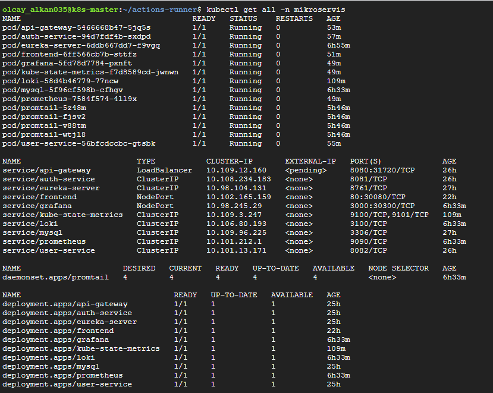

## 4.7 CI/CD Pipeline

GitHub Actions ile tam otomatik deployment pipeline'ı geliştirilmiştir. Pipeline, **self-hosted runner** üzerinde çalışmakta ve her kod değişikliğinde otomatik olarak tüm servisleri build edip Kubernetes cluster'a deploy etmektedir.

### Pipeline Mimarisi

Pipeline 6 ana aşamadan oluşmaktadır:

```
┌─────────────────────────────────────────────────────────────────┐
│  STAGE 1: BUILD & TEST (GitHub-Hosted - Paralel Matrix)         │
│  • Eureka Server, API Gateway, Auth Service, User Service       │
│  • Maven build (JDK 17, Temurin)                                │
│  • JAR artifacts upload                                         │
├─────────────────────────────────────────────────────────────────┤
│  STAGE 2: DOCKER BUILD (Self-Hosted - Paralel)                  │
│  • Download JAR artifacts                                       │
│  • Build Docker images (latest + commit SHA tags)               │
│  • Frontend Docker build (React + Nginx)                        │
├─────────────────────────────────────────────────────────────────┤
│  STAGE 3: DISTRIBUTE IMAGES (Paralel to Workers)                │
│  • Worker-1: Pull monitoring images (Prometheus, Grafana, Loki) │
│  • Worker-2: Transfer Eureka + Auth images                      │
│  • Worker-3: Transfer Gateway + User + Frontend images          │
├─────────────────────────────────────────────────────────────────┤
│  STAGE 4: DEPLOY INFRASTRUCTURE (Sequential)                    │
│  • Create namespace & secrets                                   │
│  • Deploy MySQL (wait for ready)                                │
│  • Deploy Eureka Server (wait for ready)                        │
├─────────────────────────────────────────────────────────────────┤
│  STAGE 5: DEPLOY SERVICES (Paralel)                             │
│  • Monitoring Stack: Prometheus, Loki, Promtail, Grafana        │
│  • Auth Service (Worker-2)                                      │
│  • User Service (Worker-3)                                      │
│  • API Gateway (after Auth & User)                              │
│  • Frontend (after Gateway)                                     │
├─────────────────────────────────────────────────────────────────┤
│  STAGE 6: VERIFY & HEALTH CHECK                                 │
│  • List all pods & services                                     │
│  • Display access endpoints                                     │
│  • Cleanup artifacts                                            │
└─────────────────────────────────────────────────────────────────┘
```

### Aşama Aşama Pipeline Detayları

#### 🏗️ Stage 1: Build & Test
- **Runner:** GitHub-hosted Ubuntu
- **Paralel Jobs:** 4 servis aynı anda build edilir
- **Teknoloji:** Maven Wrapper, JDK 17 (Temurin)
- **Cache:** Maven dependencies cache'lenir
- **Çıktı:** JAR artifacts (retention: 1 gün)

#### 🐳 Stage 2: Docker Build
- **Runner:** Self-hosted (k8s-master)
- **Paralel Jobs:** 5 image aynı anda build edilir
- **Features:** 
  - BuildKit inline cache kullanımı
  - Dual tagging (`latest` + commit SHA)
  - Multi-stage builds (frontend için)

#### 📤 Stage 3: Distribute Images
- **Optimizasyon:** Worker node'lara göre farklı stratejiler
  - Worker-1: Public images direkt pull (hızlı)
  - Worker-2/3: Docker save/load + SCP transfer
- **Paralel Transfer:** Her worker aynı anda yükleme yapar
- **Format:** Compressed tar.gz (network optimizasyonu)

#### 🏗️ Stage 4: Infrastructure Deployment
- **Sequential:** MySQL → Eureka (dependency sırası)
- **Health Checks:** Her deployment için rollout status kontrolü
- **Secrets:** Kubernetes secret creation (MySQL credentials)
- **Timeout:** 180 saniye (MySQL/Eureka için)

#### 🚀 Stage 5: Services Deployment
- **Paralel Deployment:** Monitoring, Auth, User aynı anda
- **Smart Dependencies:** 
  - Gateway, Auth & User'dan sonra
  - Frontend, Gateway'den sonra
- **Rolling Update:** `kubectl patch` ile deployment SHA annotation
- **Verification:** Her servis için rollout status kontrolü

#### ✅ Stage 6: Verification
- **Cluster Status:** Tüm pod ve service'lerin listesi
- **Health Check:** Node IP'leri ve erişim endpoint'leri
- **Artifact Cleanup:** Build artifacts otomatik silme

### Trigger Koşulları

Pipeline şu durumlarda çalışır:
- **Push:** `main`, `master`, `develop` branch'lerine
- **Paths:** `projeOdevi/**`, `ystFrontend/**`, `.github/workflows/**`
- **Manual:** `workflow_dispatch` ile manuel tetikleme
- **Concurrency:** Aynı branch'te birden fazla pipeline çalışmaz

### Key Features

✅ **Paralel Execution:** Build ve deployment işlemlerinin paralel yapılması ile hız  
✅ **Optimized Transfer:** Worker node'lara image transfer optimizasyonu  
✅ **Health Checks:** Her aşamada rollout status kontrolü  
✅ **Smart Dependencies:** Servisler arası dependency yönetimi  
✅ **Automated Cleanup:** Artifact'ların otomatik temizlenmesi  
✅ **Multi-Environment:** Self-hosted runner ile GCP Kubernetes entegrasyonu  

### Pipeline Görselleştirme

**CI/CD Pipeline Akış Diyagramı:**

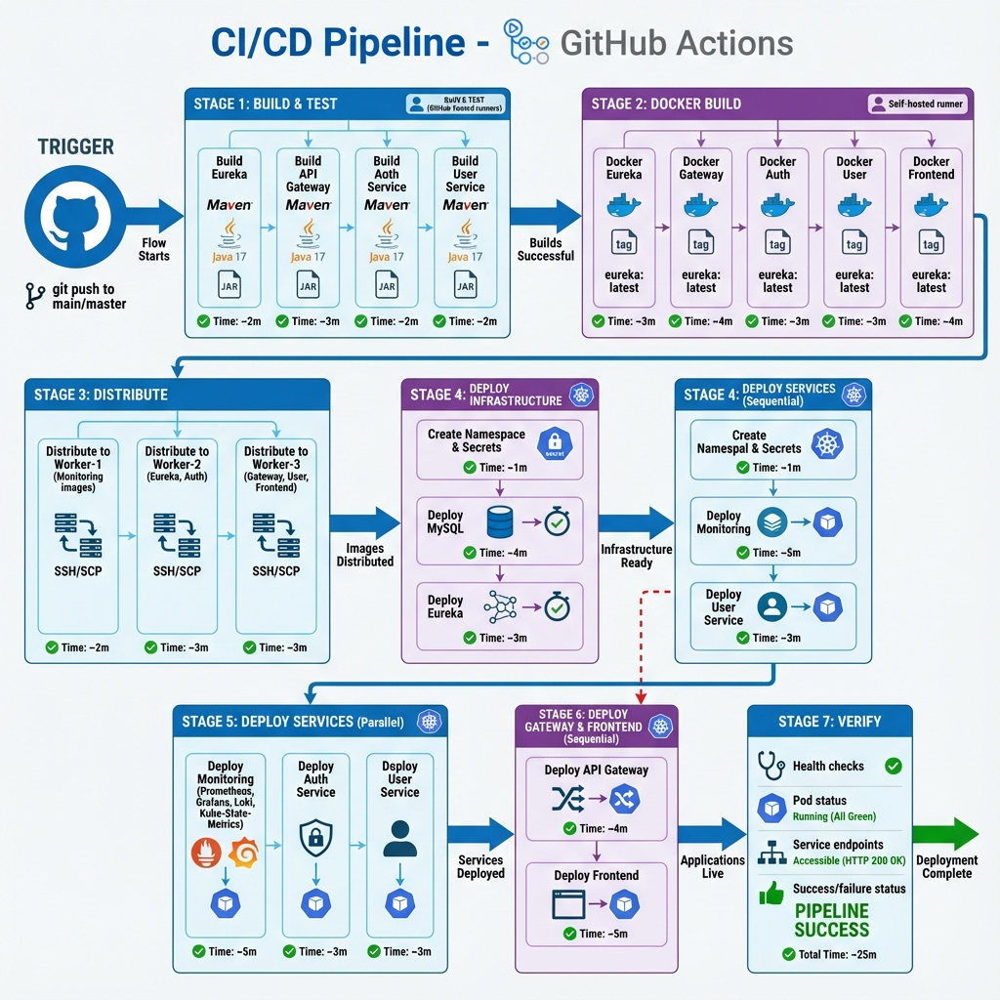

**GitHub Actions Workflow Çalışma Görünümü:**

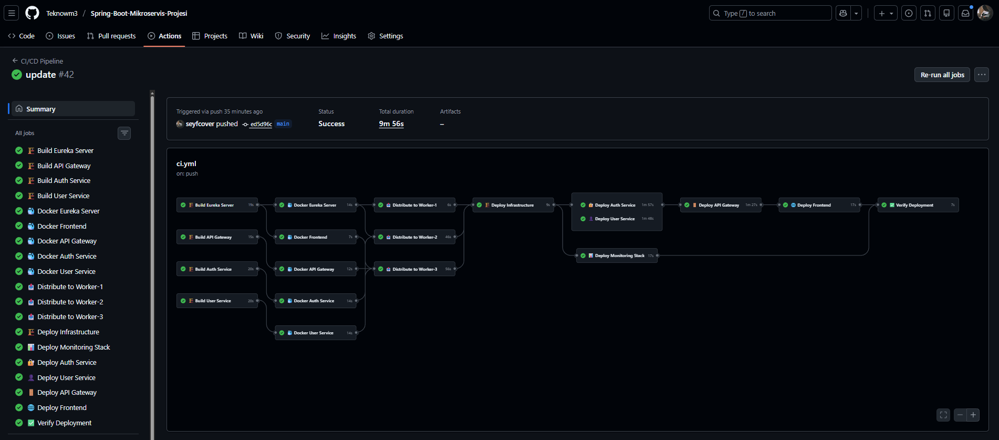

*Pipeline yaklaşık 8-12 dakikada tamamlanır. Paralel execution sayesinde seri execution'a göre %60-70 daha hızlıdır.*

## 4.8 Observability

### Prometheus Metrics
- JVM metrics (memory, CPU, threads)
- HTTP request metrics (count, latency)
- Custom application metrics

### Grafana Dashboard
- Service UP/DOWN durumu
- Request per second (RPS)
- p95 latency
- JVM heap kullanımı
- HTTP endpoint tablosu

**Grafana Dashboard - Services Metrics & Logs:**

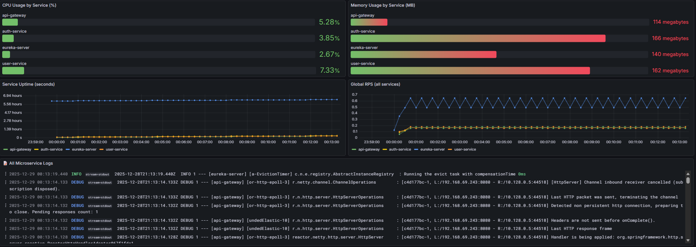

**Grafana Dashboard - JVM & HTTP Metrics:**

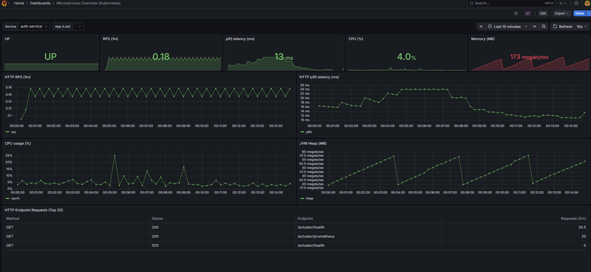

**Grafana Dashboard - Kubernetes Metrics:**

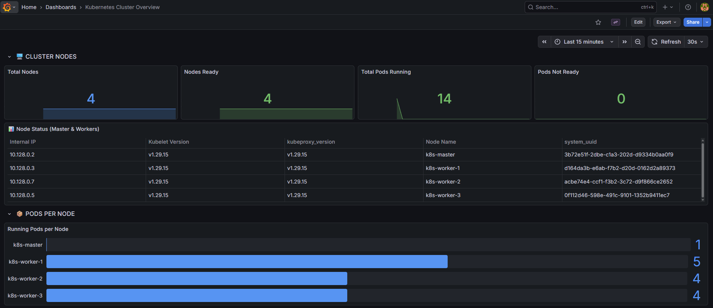

**Grafana Dashboard - Node Mapping:**

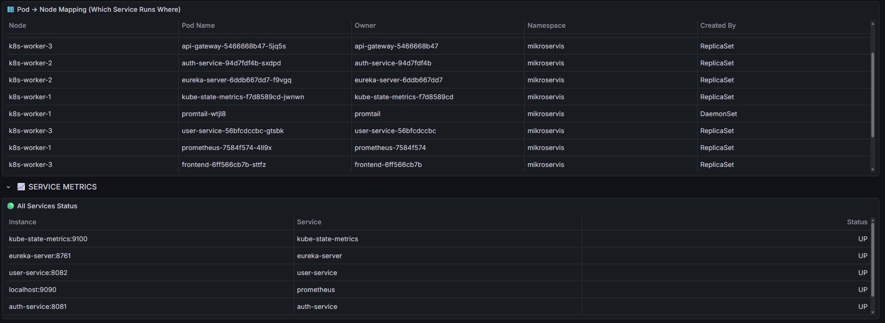

### Loki Logging
- Tüm pod logları toplanır
- Label bazlı filtreleme
- Grafana üzerinden sorgulama


---

# 5. KULLANILAN ÖZELLİKLERİN PROJEDE NASIL KULLANILDIĞI

## 5.1 REST API Kullanımı

### Auth Service Endpoints

#### 1. Register (Yeni Kullanıcı Kaydı)
```http
POST /api/auth/register
Content-Type: application/json

Request Body:
{
  "username": "olcay",
  "password": "olcay123",
  "email": "olcay@example.com"
}

Response (201 Created):
{
  "token": "eyJhbGciOiJIUzI1NiIsInR5cCI6IkpXVCJ9...",
  "username": "olcay",
  "role": "USER",
  "message": "Registration successful"
}
```

#### 2. Login (Kullanıcı Girişi)
```http
POST /api/auth/login
Content-Type: application/json

Request Body:
{
  "username": "admin",
  "password": "admin"
}

Response (200 OK):
{
  "token": "eyJhbGciOiJIUzI1NiIsInR5cCI6IkpXVCJ9...",
  "username": "admin",
  "role": "ADMIN",
  "message": "Login successful"
}
```

#### 3. Validate Token (Token Doğrulama)
```http
GET /api/auth/validate
Authorization: Bearer {token}

Response (200 OK):
{
  "valid": true
}
```

#### 4. Get Current User (Mevcut Kullanıcı Bilgisi)
```http
GET /api/auth/me
Authorization: Bearer {token}

Response (200 OK):
{
  "username": "olcay",
  "email": "olcay@example.com",
  "role": "USER"
}
```

#### 5. Health Check (Servis Sağlık Kontrolü)
```http
GET /api/auth/health
Authorization: Bearer {token}

Response (200 OK):
{
  "status": "UP"
}
```

#### 6. Update Role (Rol Güncelleme - Admin)
```http
PATCH /api/auth/users/{username}/role
Authorization: Bearer {admin_token}
Content-Type: application/json

Request Body:
{
  "role": "ADMIN"
}

Response (200 OK):
{
  "message": "Role updated"
}
```

#### 7. Create User (Kullanıcı Oluşturma - Admin)
```http
POST /api/auth/users
Authorization: Bearer {admin_token}
Content-Type: application/json

Request Body:
{
  "username": "Unknown1",
  "password": "unknown123",
  "email": "unknown1@example.com",
  "role": "USER"
}

Response (201 Created):
{
  "username": "Unknown1",
  "role": "USER",
  "message": "User created"
}
```

#### 8. Delete User (Kullanıcı Silme - Admin)
```http
DELETE /api/auth/users/{username}
Authorization: Bearer {admin_token}

Response (200 OK):
{
  "message": "User deleted"
}
```

### User Service Endpoints

#### 1. Create User Profile (Profil Oluşturma)
```http
POST /api/auth/users
Authorization: Bearer {admin_token}
Content-Type: application/json

Request Body:
{
  "username": "Seyfo",
  "password": "seyfo123",
  "email": "seyfo@example.com",
  "role": "USER"
}

Response (201 Created):
{
  "id": 5,
  "username": "Seyfo",
  "email": "seyfo@example.com",
  "role": "USER"
}
```

#### 2. Get All Users (Tüm Kullanıcılar - Admin)
```http
GET /api/users
Authorization: Bearer {admin_token}

Response (200 OK):
[
  {
    "id": 1,
    "username": "admin",
    "email": "admin@admin.local",
    "role": "ADMIN",
    "firstName": "Admin",
    "lastName": "User"
  },
  {
    "id": 2,
    "username": "olcay",
    "email": "olcay@example.com",
    "role": "USER",
    "firstName": null,
    "lastName": null
  }
]
```

#### 3. Get My Profile (Kendi Profilim)
```http
GET /api/users/me
Authorization: Bearer {token}

Response (200 OK):
{
  "id": 2,
  "username": "olcay",
  "email": "olcay@example.com",
  "role": "USER",
  "firstName": null,
  "lastName": null,
  "phone": null,
  "address": null
}
```

#### 4. Get User by ID (ID ile Kullanıcı)
```http
GET /api/users/{id}
Authorization: Bearer {token}

Response (200 OK):
{
  "id": 1,
  "username": "admin",
  "email": "admin@admin.local",
  "role": "ADMIN",
  "firstName": "Admin",
  "lastName": "User"
}
```

#### 5. Get User by Username (Username ile Kullanıcı)
```http
GET /api/users/username/{username}
Authorization: Bearer {token}

Response (200 OK):
{
  "id": 2,
  "username": "olcay",
  "email": "olcay@example.com",
  "role": "USER",
  "firstName": "Olcay",
  "lastName": "Alkan"
}
```

#### 6. Update User Profile (Profil Güncelleme)
```http
PUT /api/users/{id}
Authorization: Bearer {token}
Content-Type: application/json

Request Body:
{
  "username": "olcay",
  "email": "olcay.alkan@example.com",
  "firstName": "Olcay",
  "lastName": "Alkan",
  "phone": "0532-123-4567",
  "address": "Istanbul, Turkiye"
}

Response (200 OK):
{
  "id": 1,
  "username": "olcay",
  "email": "olcay.alkan@example.com",
  "firstName": "Olcay",
  "lastName": "Alkan",
  "phone": "0532-123-4567",
  "address": "Istanbul, Turkiye"
}
```

#### 7. Delete User by ID (ID ile Silme)
```http
DELETE /api/users/{id}
Authorization: Bearer {admin_token}

Response (200 OK / 204 No Content)
```

#### 8. Health Check (Servis Sağlık Kontrolü)
```http
GET /api/users/health
Authorization: Bearer {token}

Response (200 OK):
{
  "status": "UP"
}
```

### Postman Collection Test Senaryosu

Proje ile birlikte Postman Collection (`YST_Microservices_API.postman_collection.json`) sağlanmaktadır. Bu collection şu test senaryosunu içerir:

1. ✅ olcay kullanıcısı register et
2. ✅ olcay olarak login ol
3. ✅ Token validate et
4. ✅ Current user bilgisi al
5. ✅ Health check yap
6. ✅ olcay'ı admin yap
7. ✅ Unknown1 kullanıcısı oluştur
8. ✅ Unknown1'i admin yap
9. ✅ Unknown1'i sil

**Postman Collection Değişkenleri:**
- `baseUrl`: `http://34.135.175.32:30080` (Google Cloud Kubernetes API Gateway URL)
- `token`: JWT Token - Login sonrası otomatik set edilir
- `adminToken`: Admin JWT Token - Admin login sonrası set edilir


## 5.2 JWT Authentication Kullanımı

### Token Üretimi (Auth Service)
```java
public String generateToken(User user) {
    Map<String, Object> claims = new HashMap<>();
    claims.put("role", user.getRole().name());
    claims.put("email", user.getEmail());
    
    return Jwts.builder()
        .setClaims(claims)
        .setSubject(user.getUsername())
        .setIssuedAt(new Date())
        .setExpiration(new Date(System.currentTimeMillis() + expiration))
        .signWith(SignatureAlgorithm.HS256, secret)
        .compact();
}
```

### Token Doğrulama (API Gateway)
```java
@Component
public class JwtAuthenticationFilter implements GlobalFilter {
    public Mono<Void> filter(ServerWebExchange exchange, GatewayFilterChain chain) {
        String token = extractToken(exchange.getRequest());
        if (jwtUtil.validateToken(token)) {
            return chain.filter(exchange);
        }
        return unauthorized(exchange);
    }
}
```

## 5.3 API Gateway Routing Konfigürasyonu

```properties
# Auth Service Routes
spring.cloud.gateway.routes[0].id=auth-login
spring.cloud.gateway.routes[0].uri=lb://auth-service
spring.cloud.gateway.routes[0].predicates[0]=Path=/api/auth/login
spring.cloud.gateway.routes[0].predicates[1]=Method=POST
spring.cloud.gateway.routes[0].filters[0]=LoginRateLimitFilter

# User Service Routes
spring.cloud.gateway.routes[3].id=user-service
spring.cloud.gateway.routes[3].uri=lb://user-service
spring.cloud.gateway.routes[3].predicates[0]=Path=/api/users/**
spring.cloud.gateway.routes[3].filters[0]=JwtAuthenticationFilter
```

## 5.4 Kubernetes Deployment Örneği

```yaml
apiVersion: apps/v1
kind: Deployment
metadata:
  name: auth-service
  namespace: mikroservis
spec:
  replicas: 1
  selector:
    matchLabels:
      app: auth-service
  template:
    spec:
      nodeSelector:
        kubernetes.io/hostname: k8s-worker-2
      initContainers:
        - name: wait-for-mysql
          image: busybox:1.36
          command: ['sh', '-c', 'until nc -z mysql 3306; do sleep 5; done']
      containers:
        - name: auth-service
          image: auth-service:latest
          env:
            - name: SPRING_DATASOURCE_URL
              value: "jdbc:mysql://mysql:3306/authdb"
            - name: JWT_SECRET
              value: "..."
```

## 5.5 CI/CD Pipeline Örneği

```yaml
jobs:
  build:
    runs-on: ubuntu-latest
    strategy:
      matrix:
        service: [eureka-server, api-gateway, auth-service, user-service]
    steps:
      - uses: actions/checkout@v4
      - uses: actions/setup-java@v4
      - run: ./mvnw -B clean package -DskipTests

  deploy-services:
    runs-on: self-hosted
    needs: [distribute-worker-2, distribute-worker-3]
    steps:
      - run: kubectl apply -f projeOdevi/k8s/auth-deployment.yaml
      - run: kubectl rollout status deployment/auth-service -n mikroservis
```

## 5.6 Prometheus Metrics Toplama

```yaml
# prometheus-deployment.yaml
scrape_configs:
  - job_name: 'spring-actuator'
    metrics_path: '/actuator/prometheus'
    kubernetes_sd_configs:
      - role: pod
        namespaces:
          names: ['mikroservis']
```


---

# 6. PROJENİN ÇALIŞTIRILMASI VE TEST EDİLMESİ

## 6.1 Gereksinimler

- Google Cloud Platform hesabı
- 4 adet VM (1 master, 3 worker)
- Kubernetes cluster kurulumu
- GitHub repository

## 6.2 Deployment Adımları

### 1. Cluster Kurulumu
```bash
# Master node'da
kubeadm init --pod-network-cidr=192.168.0.0/16

# Worker node'larda
kubeadm join <master-ip>:6443 --token <token>
```

### 2. GitHub Actions Runner Kurulumu
```bash
# Master node'da
./config.sh --url https://github.com/<repo>
./run.sh
```

### 3. Deployment Tetikleme
```bash
git add .
git commit -m "Deploy"
git push
```

GitHub Actions otomatik olarak tüm deployment sürecini yönetir. Detaylı pipeline akışı için bölüm 4.7'ye bakınız.

## 6.3 Erişim Noktaları

| Servis | URL | Kullanıcı/Şifre |
|--------|-----|-----------------|
| Frontend | http://<WORKER-3-IP>:30080 | - |
| API Gateway | http://<WORKER-3-IP>:31720 | - |
| Grafana | http://<WORKER-1-IP>:30300 | admin/admin |
| Eureka Dashboard | http://<WORKER-2-IP>:8761 | - |

## 6.4 Test Senaryoları

### Senaryo 1: Kullanıcı Kaydı ve Login
1. Frontend'e git (http://<IP>:30080)
2. "Login" sayfasından sistem girişi yap veya "Register" sayfasına git
3. Kullanıcı bilgilerini gir (username, email, password)
4. "Kayıt Ol" butonuna tıkla
5. Otomatik login ve rolüne göre dashboard'a yönlendirme

**Login Sayfası:**

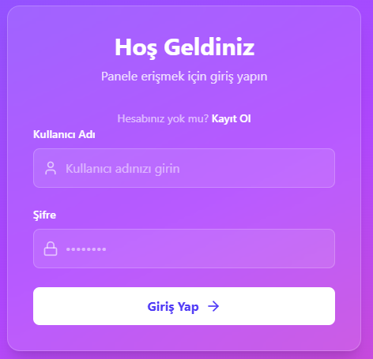

*JWT token tabanlı kimlik doğrulama. Başarılı login sonrası token localStorage'a kaydedilir ve tüm API isteklerinde Authorization header'da gönderilir.*

**Register Sayfası:**

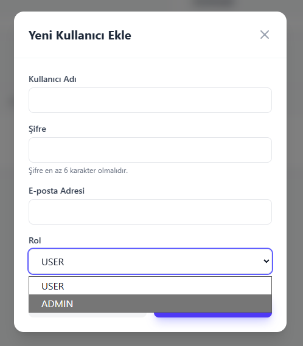

*Kullanıcı kaydı sırasında **role-based authentication** uygulanır. Normal kullanıcılar USER rolü ile kaydedilir. Admin kullanıcıları oluşturmak için admin panelinden ADMIN rolü atanması gerekir. Roller `authdb.users` tablosunda `role` kolonu (ENUM: USER, ADMIN) olarak saklanır. BCrypt ile hash'lenen şifreler aynı tabloda güvenli bir şekilde tutulur.*

**Kullanıcı Dashboard:**

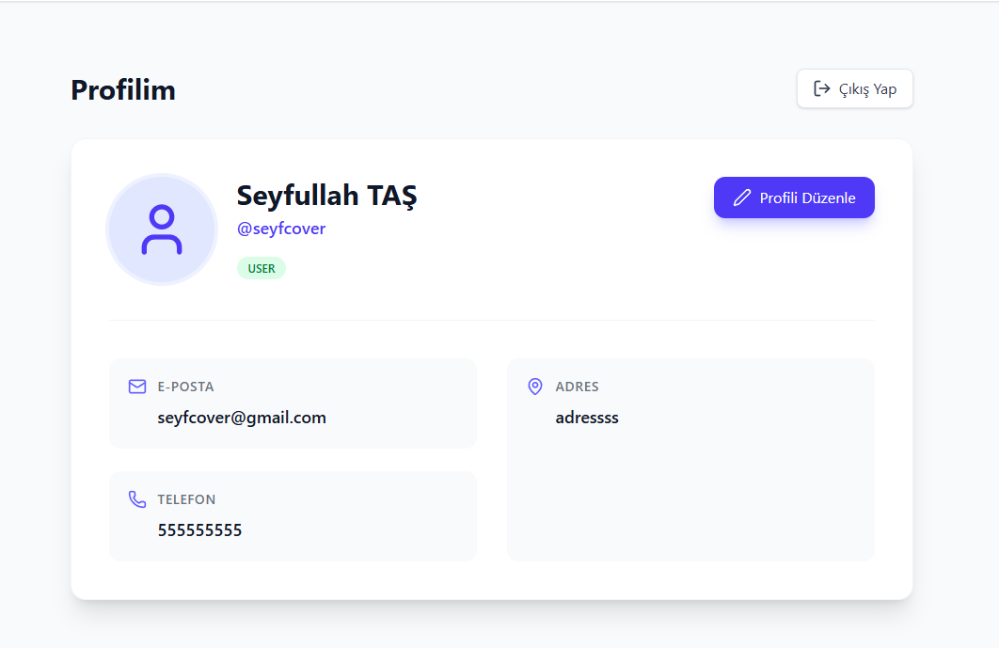

*USER rolüne sahip kullanıcıların gördüğü panel. Kendi profil bilgilerini görüntüleyebilir ve güncelleyebilir.*

### Senaryo 2: Admin Paneli ve Kullanıcı Yönetimi
1. admin/admin ile giriş yap (default admin kullanıcısı)
2. Admin paneline git
3. Tüm kullanıcıları listele ve ara
4. Kullanıcı rolünü değiştir (USER ↔ ADMIN)
5. Kullanıcı profil bilgilerini güncelle
6. Kullanıcı sil

**Admin Paneli - Kullanıcı Yönetimi:**

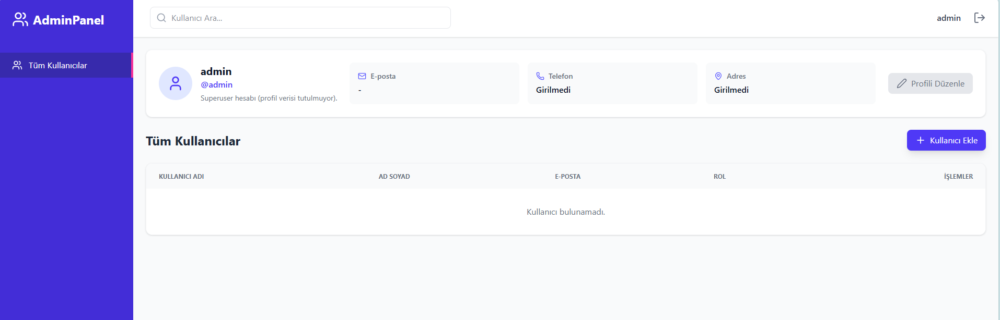

*ADMIN rolüne sahip kullanıcılara özel panel. **Role-based access control (RBAC)** ile korumalıdır. Sadece ADMIN rolündeki kullanıcılar bu panele erişebilir. Admin'ler:*
- *Tüm kullanıcıları görüntüleyebilir (`GET /api/users` - JWT token'da ADMIN rolü kontrolü)*
- *Kullanıcı rolü değiştirebilir (`PATCH /api/auth/users/{username}/role` - Database'de `authdb.users.role` güncellenir)*
- *Kullanıcı silebilir (`DELETE /api/users/username/{username}` - Hem `authdb` hem `userdb`'den silinir)*
- *Kullanıcı arama yapabilir (username veya email ile filtreleme)*

*Veritabanı yapısı: `authdb.users` tablosu kimlik doğrulama bilgilerini (username, password_hash, role), `userdb.users` tablosu ek profil bilgilerini (firstName, lastName, email) saklar. İki veritabanı arasında username ile ilişki kurulur.*

### Senaryo 3: Monitoring
1. Grafana'ya git (http://<IP>:30300)
2. admin/admin ile giriş yap
3. "Microservices Overview" dashboard'unu aç
4. Metrikleri incele
5. Logları görüntüle


### Senaryo 4: CI/CD Test
1. Kod değişikliği yap
2. Git push yap
3. GitHub Actions'tan pipeline'ı izle
4. Deployment durumunu kontrol et


## 6.5 Doğrulama Komutları

```bash
# Pod durumları
kubectl get pods -n mikroservis -o wide

# Servis durumları
kubectl get svc -n mikroservis

# Pod logları
kubectl logs -n mikroservis -l app=auth-service

# Deployment durumu
kubectl rollout status deployment/auth-service -n mikroservis
```


---

# 7. SONUÇ

Bu proje kapsamında, modern yazılım geliştirme pratiklerini içeren kapsamlı bir mikroservis uygulaması geliştirilmiştir. Proje şu özellikleri başarıyla uygulamaktadır:

✅ **REST API:** GET, POST, PUT, PATCH, DELETE metodları  
✅ **JWT Authentication:** Token tabanlı güvenli kimlik doğrulama  
✅ **API Gateway:** Merkezi routing ve rate limiting  
✅ **Kubernetes:** Container orchestration ve deployment  
✅ **CI/CD:** GitHub Actions ile otomatik deployment  
✅ **Observability:** Prometheus, Grafana, Loki ile monitoring  
✅ **Load Balancing:** Kubernetes service ile yük dengeleme  
✅ **Cloud Deployment:** Google Cloud Platform  
✅ **Ölçeklenebilirlik:** Mikroservis mimarisi  
✅ **UML Diyagramları:** Kapsamlı dokümantasyon  

Proje, gerçek dünya senaryolarına uygun, production-ready bir mikroservis uygulaması örneği sunmaktadır.

---

# EKLER

## Ek-1: UML Diyagramları ve Teknik Detaylar

Tüm UML diyagramları ve teknik görseller `/diagrams/` klasöründe bulunmaktadır.

### PlantUML Kaynak Dosyaları (`/docs/` klasörü)
- `architecture.puml` - Detaylı sistem mimarisi (Component Diagram)
- `use-case.puml` - Detaylı kullanıcı senaryoları (Use Case Diagram)

### Teknik Mimari Detayları

**Role-Based Authentication Akışı:**
```
1. Kullanıcı Register/Login yapar
2. Auth Service JWT token üretir (payload: username, role, email)
3. Token frontend'e döner ve localStorage'a kaydedilir
4. Her API isteğinde token Bearer header'da gönderilir
5. API Gateway token'ı doğrular ve rol kontrolü yapar
6. Rol yeterliyse istek ilgili mikroservise yönlendirilir
```

**Database Schema:**
- `authdb.users`: username (PK), password_hash, email, role (USER/ADMIN)
- `userdb.users`: username (PK), firstName, lastName, email, createdAt

## Ek-2: API Endpoint Listesi

| Method | Endpoint | Açıklama |
|--------|----------|----------|
| POST | /api/auth/login | Kullanıcı girişi |
| POST | /api/auth/register | Yeni kayıt |
| GET | /api/auth/me | Mevcut kullanıcı |
| PATCH | /api/auth/users/{username}/role | Rol değiştir |
| GET | /api/users | Tüm kullanıcılar |
| GET | /api/users/username/{username} | Kullanıcı detay |
| GET | /api/users/search?keyword= | Kullanıcı ara |
| PUT | /api/users/username/{username} | Profil güncelle |
| DELETE | /api/users/username/{username} | Kullanıcı sil |

## Ek-3: Kubernetes Service Ports

| Servis | Port | NodePort | Tip |
|--------|------|----------|-----|
| Frontend | 80 | 30080 | NodePort |
| API Gateway | 8080 | 31720 | LoadBalancer |
| Grafana | 3000 | 30300 | NodePort |
| MySQL | 3306 | - | ClusterIP |
| Eureka | 8761 | - | ClusterIP |
| Auth Service | 8081 | - | ClusterIP |
| User Service | 8082 | - | ClusterIP |
| Prometheus | 9090 | - | ClusterIP |
| Loki | 3100 | - | ClusterIP |
| Kube-State-Metrics | 9100 | - | ClusterIP |

---

**[SON]**
